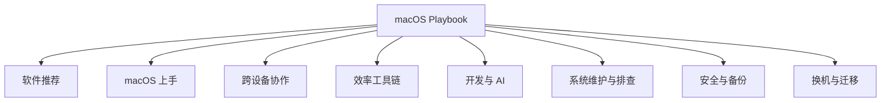

# macOS Playbook

个人 macOS 使用经验记录。从零上手到用顺手——踩过的坑、用顺手的工具、形成的习惯都在这。

在线阅读：[chendahuang.com/playbook/macos](https://chendahuang.com/playbook/macos/)

## 全景图

## 目录

- [1. 软件推荐](#1-软件推荐)
- [2. macOS 上手](#2-macos-上手)
- [3. 跨设备协作](#3-跨设备协作)
- [4. 效率工具链](#4-效率工具链)
- [5. 开发与 AI](#5-开发与-ai)
- [6. 系统维护与故障排查](#6-系统维护与故障排查)
- [7. 安全与备份](#7-安全与备份)
- [8. 换机与迁移](#8-换机与迁移)

<main class="playbook-home">
  <section class="playbook-hero">
    

      <h1>macOS 使用手册</h1>
      
从软件选择到维护换机，把 Mac 用顺、用稳、用得更久。

    

    

      <a class="playbook-action primary" href="./chapters/01-software">开始阅读<svg class="chapter-arrow" aria-hidden="true" viewBox="0 0 24 24" fill="none"><path d="M5 12h14M13 6l6 6-6 6" stroke="currentColor" stroke-width="1.8" stroke-linecap="round" stroke-linejoin="round"/></svg></a>
      <a class="playbook-action" href="#chapters">查看全部章节<svg class="chapter-arrow" aria-hidden="true" viewBox="0 0 24 24" fill="none"><path d="M5 12h14M13 6l6 6-6 6" stroke="currentColor" stroke-width="1.8" stroke-linecap="round" stroke-linejoin="round"/></svg></a>
    

  </section>

  <section class="playbook-section" id="chapters">
    

      <h2>按任务开始</h2>
      
选择当前最需要解决的问题，直接进入对应章节。

    

    

  <a class="chapter-link" href="./chapters/01-software">
    01
    <strong class="chapter-title">## 1. 软件推荐</strong>按用途挑选真正值得安装的软件和工具。
    <svg class="chapter-arrow" aria-hidden="true" viewBox="0 0 24 24" fill="none"><path d="M5 12h14M13 6l6 6-6 6" stroke="currentColor" stroke-width="1.8" stroke-linecap="round" stroke-linejoin="round"/></svg>
  </a>
  <a class="chapter-link" href="./chapters/02-getting-started">
    02
    <strong class="chapter-title">## 2. macOS 上手</strong>完成 Windows 转换、系统设置与日常操作。
    <svg class="chapter-arrow" aria-hidden="true" viewBox="0 0 24 24" fill="none"><path d="M5 12h14M13 6l6 6-6 6" stroke="currentColor" stroke-width="1.8" stroke-linecap="round" stroke-linejoin="round"/></svg>
  </a>
  <a class="chapter-link" href="./chapters/03-ecosystem">
    03
    <strong class="chapter-title">## 3. 跨设备协作</strong>用接力、剪贴板、随航、AirDrop 和安卓联动跨设备工作。
    <svg class="chapter-arrow" aria-hidden="true" viewBox="0 0 24 24" fill="none"><path d="M5 12h14M13 6l6 6-6 6" stroke="currentColor" stroke-width="1.8" stroke-linecap="round" stroke-linejoin="round"/></svg>
  </a>
  <a class="chapter-link" href="./chapters/04-productivity">
    04
    <strong class="chapter-title">## 4. 效率工具链</strong>组合 Raycast、快捷指令与窗口管理提升效率。
    <svg class="chapter-arrow" aria-hidden="true" viewBox="0 0 24 24" fill="none"><path d="M5 12h14M13 6l6 6-6 6" stroke="currentColor" stroke-width="1.8" stroke-linecap="round" stroke-linejoin="round"/></svg>
  </a>
  <a class="chapter-link" href="./chapters/05-development-ai">
    05
    <strong class="chapter-title">## 5. 开发与 AI</strong>配置终端、Git、SSH、本地 AI 与 AI Coding。
    <svg class="chapter-arrow" aria-hidden="true" viewBox="0 0 24 24" fill="none"><path d="M5 12h14M13 6l6 6-6 6" stroke="currentColor" stroke-width="1.8" stroke-linecap="round" stroke-linejoin="round"/></svg>
  </a>
  <a class="chapter-link" href="./chapters/06-maintenance">
    06
    <strong class="chapter-title">## 6. 系统维护与故障排查</strong>处理活动监视器、磁盘、网络、更新与常见故障。
    <svg class="chapter-arrow" aria-hidden="true" viewBox="0 0 24 24" fill="none"><path d="M5 12h14M13 6l6 6-6 6" stroke="currentColor" stroke-width="1.8" stroke-linecap="round" stroke-linejoin="round"/></svg>
  </a>
  <a class="chapter-link" href="./chapters/07-security-backup">
    07
    <strong class="chapter-title">## 7. 安全与备份</strong>管理权限、加密、密码与 3-2-1 备份。
    <svg class="chapter-arrow" aria-hidden="true" viewBox="0 0 24 24" fill="none"><path d="M5 12h14M13 6l6 6-6 6" stroke="currentColor" stroke-width="1.8" stroke-linecap="round" stroke-linejoin="round"/></svg>
  </a>
  <a class="chapter-link" href="./chapters/08-migration">
    08
    <strong class="chapter-title">## 8. 换机与迁移</strong>完成新机设置、旧机迁移、重装与出二手。
    <svg class="chapter-arrow" aria-hidden="true" viewBox="0 0 24 24" fill="none"><path d="M5 12h14M13 6l6 6-6 6" stroke="currentColor" stroke-width="1.8" stroke-linecap="round" stroke-linejoin="round"/></svg>
  </a>
    

  </section>

  <section class="playbook-section">
    

      <h2>全部 Playbook</h2>
      
同一套阅读系统，各自保留一个清晰主题。

    

    <nav class="playbook-family" aria-label="全部 Playbook">
      <a class="playbook-family-link" href="https://chendahuang.com/playbook/cloudflare/"><strong>Cloudflare</strong>开发、部署与生产运维</a>
      <a class="playbook-family-link" href="https://chendahuang.com/playbook/codex/"><strong>Codex</strong>长期协作与可靠交付</a>
      <a class="playbook-family-link" href="https://chendahuang.com/playbook/feishu/"><strong>飞书</strong>协作、AI 与 Agent 工作流</a>
      <a class="playbook-family-link" href="https://chendahuang.com/playbook/macos/"><strong>macOS</strong>软件、效率与系统维护</a>
    </nav>
  </section>
</main>
