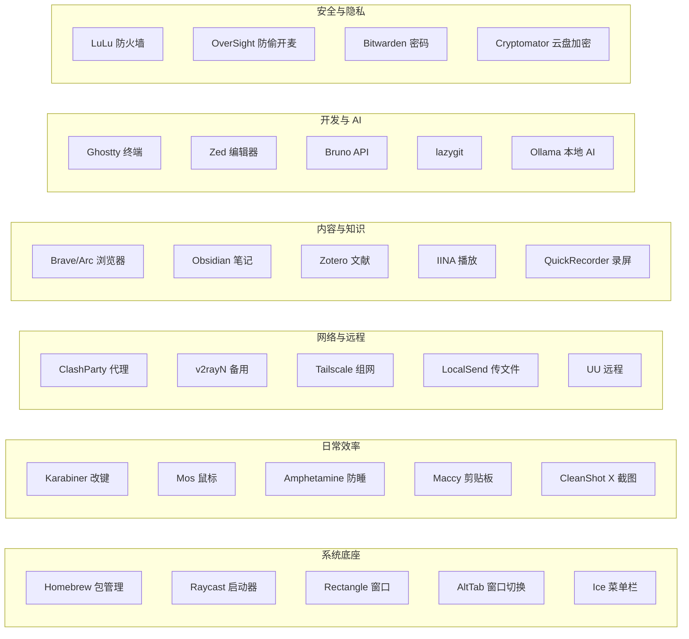

# 1. 软件推荐 {#software}

买完 Mac 先装这些。挑选原则：**免费优先、开源优先**，但好用是硬道理——付费的、闭源的、Electron 的，只要真的顺手都留。同类工具好的可以多备几个，按需装就行，不搞"全家桶"。每款标了我自己的星级和使用频率。

## 1.1 <Wrench class="cat-icon" /> 系统底座与增强

- **[Homebrew](https://brew.sh/)** ★★★★★ · 装机第一件 · [GitHub](https://github.com/Homebrew/brew)

  macOS 软件管理底座。命令行工具、图形 App、开发环境全靠它装。不会 Brew，等于浪费了 Mac 一半的终端能力。详见 [5.2 Homebrew](./05-development-ai.md#homebrew)。

- **[Raycast](https://www.raycast.com/)** ★★★★★ · 日常必用

  Spotlight 的全面上位替代。启动器 + 剪贴板历史 + 窗口管理 + 计算器 + 单位换算 + AI 对话，全塞进一个工具。免费版够用，Pro 版加 AI 和云同步。我装完 Mac 第一个装的就是它，Spotlight 直接关了。

- **[Rectangle](https://rectangleapp.com/)** ★★★★★ · 日常必用 · [GitHub](https://github.com/rxhanson/Rectangle)

  免费开源的窗口管理。`Option + 方向键` 把窗口推到左半屏、右半屏、上半屏、居中、最大化。从 Windows 过来的人装上立刻顺手。进阶可上 Rectangle Pro，支持布局记忆和快捷手势。

- **[AeroSpace](https://nikitabobko.github.io/AeroSpace/guide)** ★★★★☆ · 键盘平铺进阶 · [GitHub](https://github.com/nikitabobko/AeroSpace)

  i3 风格的平铺窗口管理器，用配置文件和键盘工作区管理窗口。适合固定多窗口布局、习惯键盘操作的开发者；普通用户仍先装 Rectangle，别为了“自动平铺”把简单问题复杂化。

- **[AltTab](https://alt-tab.app/)** ★★★★☆ · 多窗口用户刚需 · [GitHub](https://github.com/lwouis/alt-tab)

  把 `Command + Tab` 从 App 图标切换改成具体窗口切换，操作方式更接近 Windows。窗口开得多时尤其省事。免费开源。

- **[Ice](https://icemenubar.app/)** ★★★★★ · 常驻 · [GitHub](https://github.com/jordanbaird/Ice)

  菜单栏图标管理。把不常用的菜单栏图标折叠起来，需要时展开。免费开源，Bartender 的平替。菜单栏空间紧张的必装。

- **[Stats](https://mac-stats.com/)** ★★★★☆ · 常驻 · [GitHub](https://github.com/exelban/stats)

  菜单栏系统监控，CPU、GPU、内存、网速、电池、温度都能看。比一堆国产管家清爽。免费开源。

- **[MonitorControl](https://github.com/MonitorControl/MonitorControl)** ★★★★☆ · 外接显示器必装

  接第三方显示器的 Mac 用户基本都该装。用 Mac 的键盘控制外接显示器的亮度和音量，不用再伸手按显示器按钮。免费开源。

- **[BetterDisplay](https://betterdisplay.pro/)** ★★★★☆ · 按需 · [GitHub](https://github.com/waydabber/BetterDisplay)

  外接屏、HiDPI、虚拟屏、显示器调校的高级工具。免费版能用，深度功能偏付费。外接屏有疑难杂症再上它。

- **[Amphetamine](https://apps.apple.com/us/app/amphetamine/id937984704?mt=12)** ★★★★☆ · 日常使用

  防止 Mac 自动睡着的工具。可以设时长、指定某个 App 开着就不睡、下载时不睡、接了外接显示器不睡。免费，没广告没内购。想要更轻的开源替代看 [KeepingYouAwake](https://github.com/newmarcel/KeepingYouAwake)。

## 1.2 <Command class="cat-icon" /> 键盘与鼠标

- **[Karabiner-Elements](https://karabiner-elements.pqrs.org/)** ★★★★★ · 重度用户迟早要碰 · [GitHub](https://github.com/pqrs-org/Karabiner-Elements)

  macOS 最强键盘改键工具。简单改键、复杂规则、外接键盘适配都能搞。Caps Lock 改 Ctrl、F 键重映射、按 App 切换布局都靠它。免费开源。

- **[Mos](https://mos.caldis.me/)** ★★★★☆ · 外接鼠标必装 · [GitHub](https://github.com/Caldis/Mos)

  外接鼠标滚轮发涩就装这个。让普通鼠标也有触控板那种顺滑手感，每个 App 还能单独调滚动曲线和按键。免费开源。

- **[LinearMouse](https://linearmouse.app/)** ★★★★☆ · 鼠标用户 · [GitHub](https://github.com/linearmouse/linearmouse)

  鼠标滚动方向、速度、加速度、按键映射都能调，比系统设置像个人类写的东西。和 Mos 二选一或一起用都行。免费开源。

- **[Hammerspoon](https://www.hammerspoon.org/)** ★★★★☆ · 进阶自动化 · [GitHub](https://github.com/Hammerspoon/hammerspoon)

  用 Lua 脚本控制 macOS，窗口、快捷键、Wi-Fi、剪贴板都能自动化。很强，但需要愿意写点脚本。免费开源。

- **[Espanso](https://espanso.org/)** ★★★★☆ · 高频输入利器 · [GitHub](https://github.com/espanso/espanso)

  跨平台文本扩展工具。敲 `:mail` 自动展开成邮箱、`:sig` 展开成签名、代码片段模板都能搞。写作和客服式高频输入很爽。免费开源。

- **[MeetingBar](https://github.com/leits/MeetingBar)** ★★★★☆ · 会议多的人

  菜单栏显示当前/下一个会议，一键进会议。适合会议多的人。免费开源。

## 1.3 <Trash2 class="cat-icon" /> 清理与卸载

- **[腾讯柠檬清理](https://lemon.qq.com/)** ★★★★☆ · 偶尔用 · [GitHub](https://github.com/Tencent/lemon-cleaner)

  腾讯出的 Mac 清理工具。能清垃圾、卸载 App、找大文件和重复文件、看磁盘占用，菜单栏还能显示 CPU、内存这些状态。国产工具里算顺手的。

- **[Mole](https://mole.fit/)** ★★★★☆ · 偶尔用 · [CLI](https://github.com/tw93/Mole)

  命令行版免费开源，图形界面版买断制。能清理、卸载、分析磁盘、菜单栏实时看状态。tw93 出品，审美在线。

- **[AppCleaner](https://freemacsoft.net/appcleaner/)** ★★★★☆ · 卸载 App 必备

  卸载 App 时清理残留文件，简单、稳定、够用。免费。和 Mole 的卸载功能可以二选一。

## 1.4 <Globe class="cat-icon" /> 网络与代理

- **[ClashParty / Mihomo Party](https://clashparty.org/)** ★★★★★ · 常驻 · [GitHub](https://github.com/mihomo-party-org/clash-party)

  代理工具，界面比原版 Clash 友好很多。支持主题、自定义覆写、用 WebDAV 备份配置、Sub-Store 管理订阅。

- **[v2rayN](https://v2rayn.2dust.link/)** ★★★★☆ · 备用 · [GitHub](https://github.com/2dust/v2rayN)

  老牌代理工具，Windows、Mac、Linux 都能用。支持 Xray、sing-box 等核心，下载页直接有 macOS 安装包。当主力代理的备用方案很合适。

- **[Tailscale](https://tailscale.com/)** ★★★★★ · 常驻

  把你各种设备组进一个虚拟内网。装上登录同一个账号，就能远程连家里电脑、NAS、服务器，不用管端口转发那些麻烦事。

## 1.5 <FolderSync class="cat-icon" /> 文件传输与同步

- **[LocalSend](https://localsend.org/)** ★★★★★ · 局域网传文件首选 · [GitHub](https://github.com/localsend/localsend)

  跨平台局域网文件传输，不走云端，不需要互联网。安卓、Windows、Mac、iPhone 之间传文件很好用。AirDrop 的跨平台版。免费开源。

- **[Syncthing](https://syncthing.net/)** ★★★★☆ · 多设备同步 · [GitHub](https://github.com/syncthing/syncthing)

  多设备文件同步，数据全在自己设备上，不走第三方云。适合替代一部分网盘同步需求。配置略有门槛。免费开源。

- **[Cyberduck](https://cyberduck.io/)** ★★★★☆ · 云存储管理

  FTP、SFTP、WebDAV、S3、R2、OneDrive、Google Drive 都能连。云存储和服务器文件管理很好用。免费开源。

- **[Keka](https://www.keka.io/)** ★★★★☆ · 压缩解压必备 · [GitHub](https://github.com/aonez/Keka)

  macOS 压缩/解压工具，格式支持全。官网免费下载，App Store 付费版用来支持作者。

## 1.6 <Monitor class="cat-icon" /> 浏览器

- **[Brave](https://brave.com/)** ★★★★☆ · 日常使用

  主打隐私的浏览器。自带广告和追踪拦截，连 YouTube 的视频广告和前贴片都能挡掉。Chromium 内核，Chrome 插件直接能用。

- **[Arc](https://arc.net/)** ★★★★★ · 日常主力

  重新设计的浏览器。侧边栏标签、Space 分隔工作和生活、内置笔记和分屏、标签自动归档。用习惯之后回不去 Chrome。免费。

- **[Firefox](https://www.firefox.com/)** ★★★★☆ · 独立阵营

  独立浏览器阵营，扩展生态和隐私控制都不错。不想全押 Chromium 的人留一个。隐私洁癖可以上 [LibreWolf](https://librewolf.net/)（Firefox 去遥测强化版）。想要原生 Mac 体验的可以试 [Orion](https://kagi.com/orion/)（WebKit，非开源，支持 Chrome/Firefox 扩展）。

## 1.7 <Command class="cat-icon" /> 输入法

- **[豆包输入法](https://shurufa.doubao.com/)** ★★★★☆ · 日常使用 · [macOS 下载](https://shurufa.doubao.com/pc)

  字节跳动出的输入法。主打语音输入，方言能识别，说错会自动纠错，还会根据上下文猜你想打什么。

## 1.8 <Radio class="cat-icon" /> 远程与虚拟机

- **[UU 远程](https://uuyc.163.com/)** ★★★★☆ · 偶尔用 · [App Store](https://apps.apple.com/cn/app/uu远程-远程办公-游戏串流/id1642306791)

  网易出的远程桌面。手机、平板、电脑都能远控，延迟低，支持 4K 144 帧，键鼠、手柄、触控都能用，办公和游戏串流都行。不是开源工具，但免费体验很强。

- **[RustDesk](https://rustdesk.com/)** ★★★★☆ · 开源远程桌面 · [GitHub](https://github.com/rustdesk/rustdesk)

  开源远程桌面工具，可自建服务端。适合替代一部分 TeamViewer / AnyDesk 场景。想要完全自控的人选它。

- **[UTM](https://mac.getutm.app/)** ★★★★☆ · 虚拟机 · [GitHub](https://github.com/utmapp/UTM)

  免费开源虚拟机工具，基于 QEMU。跑 Linux、Windows 测试环境很方便。免费开源。

## 1.9 <Clipboard class="cat-icon" /> 剪贴板与截图录屏

- **[Maccy](https://maccy.app/)** ★★★★★ · 常驻 · [GitHub](https://github.com/p0deje/Maccy)

  轻量剪贴板历史。`Shift + Command + C` 调出，键盘选条目粘贴，纯文本优先，不存图片和大文件所以很快。开源免费。如果你用 Raycast，它的内置剪贴板历史也能用，二选一。

- **[CleanShot X](https://cleanshot.com/)** ★★★★★ · 日常必用

  截图 + 录屏 + 标注 + OCR 一体。截图自动浮在屏幕上不用先存文件，滚动截图整页网页，录屏可以选帧率。买断制，不便宜但值。

- **[Shottr](https://shottr.cc/)** ★★★★☆ · CleanShot 平替

  截图工具，免费可长期用，非开源。Mac 上体验很好。预算有限不想买 CleanShot X 用它。

- **[QuickRecorder](https://lihaoyun6.github.io/quickrecorder/)** ★★★★★ · 轻量录屏 · [GitHub](https://github.com/HaoDong108/QuickRecorder)

  轻量开源录屏神器，macOS 上比很多臃肿录屏软件舒服。日常快速录屏优先用它。

- **[OBS Studio](https://obsproject.com/)** ★★★★☆ · 录屏直播全能 · [GitHub](https://github.com/obsproject/obs-studio)

  录屏、直播、多场景、音频混流全能。功能强，但日常快速录屏不如 QuickRecorder 轻。需要直播或复杂场景再上它。免费开源。

## 1.10 <Clapperboard class="cat-icon" /> 媒体处理

- **[IINA](https://iina.io/)** ★★★★★ · 视频播放器 · [GitHub](https://github.com/iina/iina)

  macOS 最舒服的视频播放器之一，基于 mpv，原生感强。免费开源。

- **[HandBrake](https://handbrake.fr/)** ★★★★☆ · 视频转码 · [GitHub](https://github.com/HandBrake/HandBrake)

  视频转码工具，把大视频压小、转格式都很好用。免费开源。

- **[LosslessCut](https://losslesscut.app/)** ★★★★☆ · 无损剪辑 · [GitHub](https://github.com/mifi/lossless-cut)

  无损裁剪视频/音频，不重新编码，剪素材非常快。免费开源。

- **[ImageOptim](https://imageoptim.com/mac)** ★★★★☆ · 图片压缩 · [GitHub](https://github.com/ImageOptim/ImageOptim)

  图片压缩工具，做网站、公众号、博客都该用。免费开源。

- **[BlackHole](https://existential.audio/blackhole/)** ★★★★☆ · 按需 · [GitHub](https://github.com/ExistentialAudio/BlackHole)

  macOS 虚拟声卡，录系统声音、音频路由很有用。免费开源。

- **[Audacity](https://www.audacityteam.org/)** ★★★★☆ · 按需 · [GitHub](https://github.com/audacity/audacity)

  免费开源音频编辑器，录旁白、剪音频够用。

- **画图与设计（按需）**：[Krita](https://krita.org/)（绘画/插画，开源）、[GIMP](https://www.gimp.org/)（图片编辑，开源，体验硬核）、[Inkscape](https://github.com/inkscape/inkscape)（矢量图/SVG，开源）、[Blender](https://www.blender.org/)（3D，开源，功能非常强）。一般人用不上，一旦需要就很值。

## 1.11 <NotebookPen class="cat-icon" /> 知识与办公

- **[Obsidian](https://obsidian.md/)** ★★★★★ · 日常主力 · [Web Clipper](https://obsidian.md/clipper)

  本地优先的笔记软件。所有数据存在本地，文件就是纯 Markdown，不怕被平台锁死。插件生态丰富。官方 Web Clipper 能把网页、高亮存进笔记库。已有知识库就别为了"开源洁癖"硬迁移，折腾自己没必要。

- **[Typora](https://typora.io/)** ★★★★☆ · 单文件 Markdown 写作

  所见即所得的 Markdown 编辑器，适合写单篇文章、README、长文草稿。它不是知识库，更像一把顺手的 Markdown 写字刀：打开快、预览舒服、导出也省心。付费买断，先试用，喜欢再买。

- **[Zotero](https://www.zotero.org/)** ★★★★★ · 读论文/写文章必装 · [GitHub](https://github.com/zotero/zotero)

  文献管理神器，收集、整理、引用、批注都强。读论文、写文章、做研究都该装。免费开源。

- **[NetNewsWire](https://netnewswire.com/)** ★★★★☆ · 信息摄入 · [GitHub](https://github.com/Ranchero-Software/NetNewsWire)

  免费开源 RSS 阅读器，原生、干净、无算法投喂。信息摄入工具里很值得推荐。

- **[Skim](https://skim-app.sourceforge.io/)** ★★★★☆ · PDF 批注

  PDF 阅读和批注工具，特别适合读论文。免费开源。

- **[ima.copilot](https://ima.qq.com/)** ★★★★☆ · 国内 AI 知识库

  腾讯出的 AI 工作台，偏"搜、读、写 + 知识库"。如果你的资料大量来自微信公众号、网页、会议录音、中文文档，它会比纯聊天机器人更顺手。注意它是云端产品，私密资料、客户资料、公司内部文档不要无脑往里丢。

- **Obsidian 替代（按需）**：[Logseq](https://logseq.com/)（本地优先、大纲式、开源）、[Joplin](https://joplinapp.org/)（开源、支持同步加密）。不想用 Obsidian 的人可以看，但已经有 Obsidian 就别折腾。

- **办公套件（按需）**：[LibreOffice](https://www.libreoffice.org/)（开源，UI 传统）、[ONLYOFFICE](https://www.onlyoffice.com/)（Office 格式兼容更友好，界面更现代）。临时打开 Office 文档够用。

## 1.12 <Terminal class="cat-icon" /> 终端与开发工具

> 这一类是开发向的，详细用法和配置见 [第 5 节：开发与 AI](./05-development-ai.md#dev-ai)。这里只列工具清单。

- **[iTerm2](https://iterm2.com/)** ★★★★☆ · 成熟稳定

  老牌终端，分屏、热键窗口、搜索、shell integration 和 profile 管理都很成熟。已有复杂配置就继续用；新装机想要更轻、更原生，优先看 Ghostty。

- **[Warp](https://www.warp.dev/)** ★★★★☆ · 可选

  现代化终端，把命令行做成 IDE 那样。按块显示输入和输出，搜索历史命令像聊天记录，内置 AI 补全。免费版够用。

- **[Ghostty](https://ghostty.org/)** ★★★★★ · 开发首选 · [GitHub](https://github.com/ghostty-org/ghostty)

  新一代终端，快、原生、GPU 渲染，体验很现代。现在我会优先推荐它，而不是继续抱着 iTerm2 当传家宝。免费开源。

- **[Zed](https://zed.dev/)** ★★★★☆ · 高性能编辑器 · [GitHub](https://github.com/zed-industries/zed)

  Rust 写的高性能代码编辑器，启动快，AI 和协作方向在做。适合愿意尝鲜的开发者。免费开源。

- **[VSCodium](https://vscodium.com/)** ★★★★☆ · 无遥测 VS Code · [GitHub](https://github.com/VSCodium/vscodium)

  VS Code 的自由开源构建版本，去掉微软遥测。生态还是 VS Code 生态。免费开源。

- **[TRAE / TRAE CN](https://www.trae.ai/)** ★★★★☆ · AI IDE 候选

  字节出的 AI IDE。国际版和国内版模型、账号、网络环境不完全一样，可以按使用场景二选一；如果你经常让 AI 读项目、改代码、生成页面，它适合和 Cursor、VS Code 放在同一类里比较。别因为免费就把主力项目全迁过去，先拿小项目试稳定性和模型质量。

- **[Bruno](https://www.usebruno.com/)** ★★★★★ · API 调试首选 · [GitHub](https://github.com/usebruno/bruno)

  Postman 替代品，本地优先、Git 友好、开源。API 调试我会优先推荐它。免费开源。

- **[DBeaver Community](https://dbeaver.io/)** ★★★★☆ · 数据库管理 · [GitHub](https://github.com/dbeaver/dbeaver)

  免费开源数据库管理工具，支持 PostgreSQL、MySQL、SQLite 等。功能全，UI 有点 Java 味。想要更现代的体验看 [Beekeeper Studio](https://www.beekeeperstudio.io/)。

- **[lazygit](https://lazygit.dev/)** ★★★★☆ · 终端 Git UI · [GitHub](https://github.com/jesseduffield/lazygit)

  终端 Git UI 神器。熟悉命令行以后，比 [GitHub Desktop](https://desktop.github.com/) 更快。免费开源。

- **[Colima](https://colima.run/)** ★★★★☆ · Docker Desktop 替代 · [GitHub](https://github.com/abiosoft/colima)

  免费开源的 Docker Desktop 替代方案，轻量，适合本地容器开发。免费开源。

- **命令行神器**（全部 `brew install` 一行装好，详见 [5.2 Homebrew](./05-development-ai.md#homebrew)）：
  - **[ripgrep](https://github.com/BurntSushi/ripgrep)** · 替代 `grep` · 超快文本搜索，写代码找东西必装
  - **[fzf](https://github.com/junegunn/fzf)** · 命令行模糊搜索神器，文件、历史命令、Git 分支都能搜
  - **[fd](https://github.com/sharkdp/fd)** · 替代 `find` · 命令更短，速度更快
  - **[bat](https://github.com/sharkdp/bat)** · 替代 `cat` · 更好看的查看，支持语法高亮和 Git 信息
  - **[zoxide](https://github.com/ajeetdsouya/zoxide)** · 替代 `cd` · 更聪明的跳目录，根据使用频率跳
  - **[eza](https://github.com/eza-community/eza)** · 替代 `ls` · 现代版 ls，颜色、图标、Git 状态更舒服
  - **[yazi](https://yazi-rs.github.io/)** · 终端文件管理器，速度快，适合键盘流
  - **[jq](https://jqlang.org/)** · JSON 处理必备，调 API、看日志、写脚本都离不开

## 1.13 <Bot class="cat-icon" /> 本地 AI

- **[Ollama](https://ollama.com/)** ★★★★★ · 本地 LLM 底座 · [官网下载](https://ollama.com/download/mac)

  本地模型运行底座。开发者玩本地 LLM 基本绕不开。免费。

- **[Open WebUI](https://docs.openwebui.com/)** ★★★★☆ · 自托管 AI 工作台 · [GitHub](https://github.com/open-webui/open-webui)

  给 Ollama / OpenAI 兼容 API 套一个自托管 Web UI。适合本地 AI 工作台。免费开源。

- **[Jan](https://jan.ai/)** ★★★★☆ · 友好 GUI · [GitHub](https://github.com/janhq/jan)

  开源本地 AI 助手，GUI 体验比纯命令行友好。想轻松跑本地模型的人用它。免费开源。

- **[LM Studio](https://lmstudio.ai/)** ★★★★☆ · 按 GUI 选

  免费但闭源，本地模型 GUI 很成熟。不想折腾 Docker 和命令行的人用它。免费。

## 1.14 <Shield class="cat-icon" /> 安全与隐私

> 这一类详见 [第 7 节：安全与备份](./07-security-backup.md#security-backup)。这里只列工具清单。

- **[LuLu](https://objective-see.org/products/lulu.html)** ★★★★★ · 出站防火墙 · [GitHub](https://github.com/objective-see/LuLu)

  Objective-See 出品的免费开源出站防火墙，能拦截未知 App 往外联网。Mac 安全工具里非常值得装。

- **[OverSight](https://objective-see.org/products/oversight.html)** ★★★★☆ · 防偷开麦/摄像头

  监控摄像头和麦克风调用，防止 App 偷偷开麦开摄像头。免费开源。

- **[Bitwarden](https://bitwarden.com/)** ★★★★☆ · 密码管理 · [GitHub](https://github.com/bitwarden)

  免费版支持无限密码和多设备，跨平台体验好。想要完全本地离线看 [KeePassXC](https://keepassxc.org/)。详见 [7.6 密码管理](./07-security-backup.md#security-backup)。

- **[Cryptomator](https://cryptomator.org/)** ★★★★☆ · 云盘加密 · [GitHub](https://github.com/cryptomator/cryptomator)

  给云盘文件做客户端加密，适合 iCloud、Dropbox、Google Drive、OneDrive。免费开源。更硬核的磁盘加密看 [VeraCrypt](https://veracrypt.io/)。

## 1.15 软件全景

