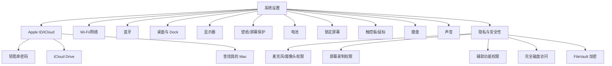

<script setup>
import { Package, Command, Share2, Zap, Code, Wrench, Shield, ArrowRightLeft, Trash2, Globe, FolderSync, Monitor, Radio, Clipboard, Clapperboard, NotebookPen, Terminal, Bot } from '@lucide/vue'
</script>

# 2. macOS 上手 {#macos}

## 2.1 Windows → Mac 概念对照

从 Windows 切到 Mac，最大的障碍不是操作，是概念。下面这张表覆盖了大多数困惑：

| Windows 习惯 | macOS 对应 | 区别说明 |
| --- | --- | --- |
| `Ctrl` 是主操作键 | `Command` 是主操作键 | 复制粘贴 `Command + C/V`，不是 `Ctrl` |
| `Alt` 是替代键 | `Option` 是隐藏能力键 | 按住 Option 菜单会多出选项，后面专讲 |
| 开始菜单是启动入口 | Spotlight 是启动入口 | `Command + Space`，搜文件也开 App |
| 资源管理器管文件 | Finder 管文件 | Finder 没有地址栏，有路径栏 |
| 任务栏代表窗口 | Dock 代表 App | Dock 是 App 摆放区，不是窗口列表 |
| `Alt + Tab` 切窗口 | `Command + Tab` 切 App | 同 App 多窗口用 `` Command + ` `` |
| 关窗口就是退出 | 关窗口不退出 App | 红色关闭只关窗口，`Command + Q` 才退出 |
| 任务管理器 | 活动监视器 | `Option + Command + Esc` 快捷强制退出 |
| 控制面板 | 系统设置 | 权限、输入、显示、触控板都在这里 |
| 安装：exe/msi | 安装：dmg/pkg | dmg 拖进 Applications，pkg 像安装向导 |
| 卸载：控制面板 | 卸载：拖到废纸篓 | 残留配置在 `~/Library/Application Support` |
| 右键菜单 | 右键 / 双指点按 | 触控板双指点击 = 右键 |
| 剪贴板历史 | 系统没有 | 装 Maccy 或 Raycast 补 |
| 截图工具 | `Command + Shift + 3/4/5` | 系统自带，不需要装额外工具 |

::: tip 核心认知
macOS 的基本单位是 **App**，不是窗口。一个 App 可以有多个窗口，关掉所有窗口 App 还在跑。这个概念想通了，其他都好说。
:::

## 2.2 初次设置清单

新 Mac开机后按顺序过一遍：

| 顺序 | 设置项 | 建议 | 为什么 |
| --- | --- | --- | --- |
| 1 | Apple ID / iCloud | 登录 | 钥匙串和查找设备必须开 |
| 2 | 触控板 | 开轻点点按 | 默认按压太累，轻点就够了 |
| 3 | 触控板 | 三指拖移按需 | 我用过一年关了，和三指轻点查词冲突 |
| 4 | 键盘 | 检查修饰键 | 外接键盘 Command/Option 经常反 |
| 5 | Dock | 只留高频 App | 自动隐藏开起来，屏幕空间更大 |
| 6 | Finder | 显示路径栏、状态栏、扩展名 | 默认藏太多东西 |
| 7 | 截图 | `Command + Shift + 5` 先试一次 | 改保存位置和延迟计时器 |
| 8 | 锁屏 | 密码 + Touch ID | 时间设短，5 分钟以内 |
| 9 | FileVault | 开 | 全盘加密，丢了别人读不了 |
| 10 | Time Machine | 配上 | 插上硬盘就自动备份 |

## 2.3 全局快捷键

| 操作 | 快捷键 | 备注 |
| --- | --- | --- |
| 开 App 或搜文件 | `Command + Space` | Spotlight，建议换成 Raycast |
| 切换 App | `Command + Tab` | 按住 Shift 反向切 |
| 同 App 切换窗口 | `` Command + ` `` | 同 App 多窗口必备 |
| 关窗口 | `Command + W` | 只关窗口不退出 |
| 退出 App | `Command + Q` | 真正退出 |
| 强制退出 | `Option + Command + Esc` | App 卡死时用 |
| App 偏好设置 | `Command + ,` | 几乎所有 App 通用 |
| 隐藏 App | `Command + H` | 不是最小化，是隐藏 |
| 最小化窗口 | `Command + M` | 收到 Dock 右侧 |
| 新建 | `Command + N` | 新窗口/新文件 |
| 保存 | `Command + S` | |
| 打印 | `Command + P` | |
| 撤销/重做 | `Command + Z` / `Shift + Command + Z` | |
| 全选 | `Command + A` | |
| 查找 | `Command + F` | |

## 2.4 Finder

Finder 是 macOS 的文件管理器，但默认配置藏了很多功能。先打开这些：

```text
Finder → 菜单栏 → 显示
  ✓ 显示路径栏      （底部显示当前路径）
  ✓ 显示状态栏      （底部显示文件数和剩余空间）
  ✓ 显示预览面板    （右侧显示文件预览）
  
Finder → 菜单栏 → Finder → 设置 → 高级
  ✓ 显示所有文件扩展名
  ✓ 已选项目时在废纸篓中显示警告
```

| 操作 | 快捷键/方式 |
| --- | --- |
| 预览文件 | 选中按 `Space`（Quick Look，不用打开 App） |
| 重命名 | 选中按 `Return` |
| 前往路径 | `Command + Shift + G`（直接输入 `/usr/local` 这种路径） |
| 显示隐藏文件 | `Command + Shift + .` |
| 复制路径 | `Option + Command + C` |
| 新建文件夹 | `Command + Shift + N` |
| 删除 | `Command + Delete`（移到废纸篓） |
| 清空废纸篓 | `Shift + Command + Delete` |
| 标签 | 给文件打颜色标签，侧边栏筛选 |
| 智能文件夹 | `Command + Option + N`，按条件自动筛选出来 |
| 标签页 | `Command + T`（Finder 也支持标签页） |
| 多文件预览 | 选中多个按 `Space`，可翻页 |
| 分栏视图 | `Command + 3`（我最常用的视图） |
| 图标视图 | `Command + 1` |
| 列表视图 | `Command + 2` |
| 拖拽文件到路径栏 | 等于移动到那一层 |
| 查看文件夹大小 | `Command + I`（显示简介） |

文件分区建议：

| 区域 | 用途 | 管理原则 |
| --- | --- | --- |
| 桌面 | 临时工作区 | 不要长期堆，周末清一次 |
| 下载 | 临时入口 | 每周清一次，大文件移走 |
| 文稿 | 长期文件 | 按项目分文件夹 |
| iCloud Drive | 多设备同步 | 注意：同步不是备份 |
| 外接硬盘 | 归档、备份 | Time Machine + 手动归档 |

::: warning 踩坑提醒
Finder 的"复制"（`Command + D`）是在同一目录创建副本，不是复制到剪贴板。要复制到别处，用 `Command + C` 然后 `Command + V`（复制）或 `Option + Command + V`（移动）。
:::

## 2.5 窗口与桌面空间

| 操作 | 快捷键/方式 |
| --- | --- |
| 隐藏 App | `Command + H`（隐藏后 `Command + Tab` 切回来） |
| 最小化窗口 | `Command + M` |
| 看全部窗口和桌面 | 触控板三/四指上滑，或 `F3` |
| 切桌面 | `Control + 左/右` |
| 分屏 | 绿色按钮长按，或拖窗口到屏幕边缘 |
| 看当前 App 所有窗口 | 触控板四指下滑 |
| 直接最大化 | 绿色按钮点一下（全屏模式） |

我的桌面分法：

```text
桌面 1：浏览器 + 笔记    （日常浏览和记录）
桌面 2：编辑器 + 终端    （开发工作）
桌面 3：会议 + 资料       （开会时切过来）
全屏：需要专注的任务      （写长文、看文档）
```

::: tip 效率建议
窗口管理用 Rectangle 比 macOS 自带分屏更快。`Option + 方向键` 左半屏、右半屏、居中，比长按绿色按钮快得多。
:::

## 2.6 Spotlight / Raycast

`Command + Space` 可以承担启动器、搜索和快捷操作入口。装上 Raycast 后，这些能力会更完整：

| 需求 | Spotlight 输入 | Raycast 额外能力 |
| --- | --- | --- |
| 开 App | `safari`、`terminal` | 同上，但更快 |
| 搜文件 | 文件名、关键词 | 支持模糊匹配和最近文件 |
| 查设置项 | `键盘`、`显示器` | |
| 算数 | `128*7` | 支持更多数学函数 |
| 单位换算 | `10 usd`、`20 cm` | |
| 剪贴板历史 | 不支持 | `Shift + Command + C` 调出 |
| 窗口管理 | 不支持 | 装 Rectangle 扩展 |
| AI 对话 | 不支持 | Pro 版内置 |

## 2.7 截图与录屏

| 场景 | 快捷键 | 备注 |
| --- | --- | --- |
| 截全屏 | `Command + Shift + 3` | 自动保存到桌面 |
| 截区域 | `Command + Shift + 4` | 拖选区域 |
| 截窗口 | `Command + Shift + 4` 后按 `Space` | 光标变成相机，点窗口 |
| 截图录屏面板 | `Command + Shift + 5` | 可以改保存位置、设计时器 |
| 截图进剪贴板 | 以上加按 `Control` | 不存文件，直接粘贴 |

截图后右下角预览缩略图可点开标注，不点自动保存。

::: tip 改截图保存位置
默认截图全堆桌面，很乱。`Command + Shift + 5` → 选项 → 存储到 → 选一个文件夹。我专门建了 `~/Downloads/Screenshots`。
:::

## 2.8 文本编辑快捷键

| 场景 | 快捷键 |
| --- | --- |
| 跳行首/行尾 | `Command + 左/右` |
| 跳文档开头/结尾 | `Command + 上/下` |
| 按词移动光标 | `Option + 左/右` |
| 按词选择 | `Shift + Option + 左/右` |
| 选到行首/行尾 | `Shift + Command + 左/右` |
| 选到文档开头/结尾 | `Shift + Command + 上/下` |
| 删左侧一个词 | `Option + Delete` |
| 删到行首 | `Command + Delete` |
| 删到行尾 | `Control + K` |
| 粘贴匹配样式 | `Option + Shift + Command + V` |

## 2.9 Option 键的隐藏能力

Option 是 macOS 上最有意思的键。按住它，菜单和操作会变出额外选项：

| 场景 | 不按 Option | 按住 Option |
| --- | --- | --- |
| 菜单栏 Apple 图标 | "退出 App" | "强制退出 App" |
| Dock 分隔线 | 进 App 偏好设置 | 直接进调度中心 |
| 关闭按钮（红色） | 关当前窗口 | 关当前 App 所有窗口 |
| 音量图标 | 调音量 | 直接进声音设置 |
| Wi-Fi 图标 | 开关 Wi-Fi | 显示 IP、MAC 等详细信息 |
| 蓝牙图标 | 开关蓝牙 | 显示蓝牙详细信息 |
| 拖拽文件 | 移动 | 变成复制（出现 + 号） |
| 粘贴文件 | `Command + V` 复制 | `Option + Command + V` 移动 |
| 光标拖拽选文本 | 正常选择 | 矩形区域选择 |

::: tip 记住一个习惯
看到菜单想找更多选项，先按住 Option 试试。macOS 很多隐藏功能都挂在 Option 键上。
:::

## 2.10 触控板

Mac 触控板在笔记本里是公认的好用。但默认设置没有全开。

| 手势 | 作用 | 在哪开 |
| --- | --- | --- |
| 轻点点按 | 替代按压 | 系统设置 → 触控板 → 轻点来点按 |
| 三指拖移 | 移动窗口、选文本 | 系统设置 → 辅助功能 → 指针控制 → 触控板选项 → 拖移方式 |
| 三指轻点 | 查词 | 系统设置 → 触控板 → 轻点来查词 |
| 双指捏合 | Launchpad | 系统设置 → 触控板 → 更多手势 |
| 双指张开 | 显示桌面 | 同上 |
| 双指滚动 | 页面滚动 | 默认开启 |
| 双指缩放 | 放大缩小 | 默认开启 |
| 双指旋转 | 旋转图片 | 默认开启 |
| 双指从右边缘滑入 | 通知中心 | 默认开启 |

::: warning 三指拖移的取舍
三指拖移很好用——手指不用按下去就能拖窗口、选文本。但它和三指轻点查词冲突。解决方案：把查词改成双指轻点，或者像我一样关掉三指拖移，习惯用力按压拖移。
:::

## 2.11 菜单栏

| 操作 | 方式 |
| --- | --- |
| 重排图标 | 按住 `Command` 拖拽 |
| 移除图标 | 按住 `Command` 拖出菜单栏 |
| 进对应设置 | `Option + 点击` 音量、Wi-Fi 等图标 |
| 看日期时间 | 默认显示 |
| 看电池百分比 | 系统设置 → 控制中心 → 电池 → 显示百分比 |

菜单栏空间有限，图标太多用 Ice 折叠不常用的。

## 2.12 Dock 进阶

| 操作 | 方式 |
| --- | --- |
| 添加 App 到 Dock | 从 Applications 拖进去 |
| 移除 App | 拖出 Dock（App 没运行时） |
| 调大小 | 系统设置 → 桌面与 Dock → 大小滑块 |
| 自动隐藏 | 系统设置 → 桌面与 Dock → 自动隐藏和显示 Dock |
| 改放大效果 | 系统设置 → 桌面与 Dock → 放大 |
| 拖文件到 Dock 图标 | 用对应 App 打开文件 |
| 右键 App 图标 | 最近打开的文件、选项 |
| `Control + 点击` Dock 分隔线 | Dock 偏好设置快捷入口 |

::: tip 我的 Dock 习惯
Dock 只放 5-6 个高频 App：Finder、浏览器、编辑器、终端、笔记。其他用 Raycast 启动。Dock 自动隐藏，把屏幕空间让给内容。
:::

## 2.13 系统设置地图

macOS 的系统设置像一个总控制台，这里列出最常用的入口：


