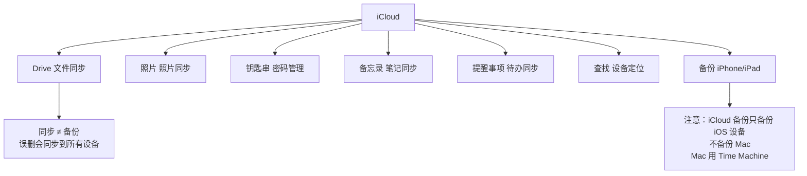

# 3. 跨设备协作 {#ecosystem}

Apple 生态最香的部分。如果你同时有 iPhone、iPad、Apple Watch，这些功能能让你的设备像一台机器一样配合。

## 3.1 接力（Handoff）

在 iPhone 上干到一半的事，Mac 上接着干。反过来也行。

| 条件 | 要求 |
| --- | --- |
| 账号 | 所有设备登录同一个 Apple ID |
| 蓝牙/Wi-Fi | 都打开 |
| 距离 | 在彼此附近（蓝牙范围） |

支持接力的 App：Safari、邮件、备忘录、提醒事项、地图、信息、日历、Keynote、Pages、Numbers。

使用方式：Mac Dock 底部会出现一个带 App 图标的图标，点一下就接力。

## 3.2 通用剪贴板

在 iPhone 上复制，在 Mac 上粘贴。反过来也行。

::: tip 使用条件
和接力一样：同一 Apple ID、蓝牙和 Wi-Fi 都开、设备在附近。不需要任何设置，直接复制粘贴就行。如果偶尔不灵，重启蓝牙和 Wi-Fi。
:::

## 3.3 随航（Sidecar）

把 iPad 变成 Mac 的第二块屏幕。有线或无线都行。

| 用途 | 场景 |
| --- | --- |
| 扩展桌面 | 多一块屏幕放参考文档 |
| 镜像屏幕 | 给别人演示 |
| 绘画板 | 用 Apple Pencil 在 iPad 上画，直接进 Mac |

开启：系统设置 → 显示器 → 添加显示器 → 选你的 iPad。

## 3.4 通用控制（Universal Control）

一套键盘鼠标控制多台 Mac 和 iPad。光标从一台 Mac 的屏幕边缘滑出去，就到了另一台 Mac 上。

| 和随航的区别 | 说明 |
| --- | --- |
| 随航 | iPad 是 Mac 的副屏，共享 Mac 的画面 |
| 通用控制 | 每台设备是独立的，只共享键鼠 |

::: tip 我的使用场景
 MacBook 接显示器做主屏，iPad 用通用控制放旁边看文档。光标拖过去就能在 iPad 上操作，拖文件也行。比远程桌面快。
:::

## 3.5 AirDrop

Apple 设备之间传文件，不需要网络，不需要数据线。

| 操作 | 方式 |
| --- | --- |
| 发送 | 文件右键 → 共享 → AirDrop → 选设备 |
| 接收 | 弹窗点接受 |
| 从 iPhone 发到 Mac | 照片/文件 → 分享 → AirDrop → 选你的 Mac |

::: tip AirDrop 不灵的时候
1. 检查双方都开了 Wi-Fi 和蓝牙
2. 检查接收方的 AirDrop 设置不是"仅联系人"（改成"所有人"试试）
3. 都关一次 Wi-Fi 和蓝牙再开
4. 实在不行，重启
:::

## 3.6 iPhone 手机热点

Mac 和 iPhone 之间的热点是自动的，不需要在 iPhone 上手动开热点。

| 条件 | 要求 |
| --- | --- |
| 账号 | 同一个 Apple ID |
| 蓝牙/Wi-Fi | 都打开 |
| 距离 | 在附近 |

使用：Mac 菜单栏 Wi-Fi 图标 → 列表里直接看到你的 iPhone 个人热点 → 点击连接。

## 3.7 iMessage 和短信转发

在 Mac 上收发 iPhone 的短信和 iMessage。

| 类型 | 说明 |
| --- | --- |
| iMessage | Apple 设备之间，走网络，免费 |
| SMS 短信 | 通过 iPhone 转发，需要在 iPhone 上开 |

开启：iPhone 设置 → 信息 → 文字信息转发 → 选你的 Mac。

## 3.8 iCloud 生态

iCloud 由多套同步能力组成。下面分清每一部分负责什么：

| 服务 | 同步什么 | 要点 |
| --- | --- | --- |
| iCloud Drive | 文件 | 多设备访问同一份文件。**不是备份**，误删会同步删 |
| iCloud 照片 | 照片视频 | 全部设备同步。优化存储可以省本地空间 |
| 钥匙串 | 密码 | Safari 和 App 的密码自动填充，全设备同步 |
| 备忘录 | 笔记 | 多设备同步，支持 checklist、表格、加密 |
| 提醒事项 | 待办 | 多设备同步，支持位置和时间提醒 |
| 查找 | 设备定位 | 丢了 Mac/iPhone 可以定位、发声、抹掉 |

::: warning 最重要的认知
**iCloud 同步不是备份。** 同步会把误删和误覆盖也同步到所有设备。Time Machine 才能让你回到之前的状态。
:::

## 3.9 第三方安卓手机与 Mac 联动

Apple 设备之间的协作最完整，国内安卓厂商近年也补齐了不少 Mac 端能力。如果你是“Mac + 安卓手机”双持用户，安装手机厂商的 Mac 客户端后，也能完成文件互传、通知同步等常用操作。2019 年小米、OPPO、vivo 牵头成立“互传联盟”，统一了**安卓手机之间**的跨品牌文件互传；各家的 Mac 客户端仍由厂商分别维护。

### 主流厂商方案对比

| 厂商 | Mac 端应用 | 手机端要求 | 主要能力 |
| --- | --- | --- | --- |
| 小米 / Redmi | 小米互联服务 | HyperOS 2+（部分功能 3+） | 妙享桌面、跨设备相机、文件互传、通知同步、屏幕扩展、查找设备 |
| OPPO / 一加 / 真我 | OPPO 互联 | ColorOS 13+ | 文件/照片管理、手机投屏、便签同步、远程控制电脑 |
| vivo / iQOO | vivo 办公套件（量子套件） | OriginOS 4+ | 跨屏互动、键鼠协同、远程控制、原子笔记/日历/相册、超级剪贴板 |

### 小米互联服务（功能最完整）

小米对 Mac 端挺上心，Mac 端能力是目前国产安卓里覆盖最广的，体验也最接近 Apple 自己的接力 + 通用剪贴板 + 随航那一套。

| 能力 | 说明 |
| --- | --- |
| 妙享桌面 | Mac 上以窗口形态打开小米手机，最多同时开 2 个应用窗口，支持拖拽文件互传 |
| 跨设备相机 | Mac 视频通话时把小米手机当摄像头，灵活切换视角 |
| 跨设备解锁 | 用 Mac 的触控 ID / 面容 ID / 密码快速解锁妙享桌面 |
| 文件互传 | 双向传输，走"小米互传"，同一局域网即可，不需要数据线 |
| 通知同步 | 小米手机的通知在 Mac 上镜像显示，可直接点击回复 |
| 屏幕扩展 | 把小米平板作为 Mac 的副屏（仅小米平板，需 HyperOS 3+） |
| 查找设备 | 手机静音也能响铃，地图查看位置和移动轨迹 |
| 一键热点 | Mac 没网时一键开小米手机热点，结束再一键关 |

::: tip 使用条件
- Mac 升级到 macOS 12 及以上
- 小米手机升级到 HyperOS 2 及以上，部分功能要 HyperOS 3
- Mac 在 App Store 搜"小米互联服务"安装，或从官网 [hyperos.mi.com/continuity](https://hyperos.mi.com/continuity) 下载 dmg
- 双方登录同一个小米账号、连同一局域网、开蓝牙
:::

### OPPO 互联（OPPO / 一加 / 真我通用）

OPPO 互联是 ColorOS 的跨生态互联服务，覆盖 OPPO、一加、真我全系机型，定位偏向办公协作。

| 能力 | 说明 |
| --- | --- |
| 文件/照片管理 | Mac 上直接浏览和管理手机里的文件与相册 |
| 手机投屏 | 把手机屏幕投到 Mac 上演示或操作 |
| 跨端同步便签 | OPPO 便签和 Mac 之间双向同步 |
| 远程控制电脑 | 手机反向远程控制 Mac |

::: tip 使用条件
- Mac 升级到 macOS 12 及以上
- 手机装 ColorOS 13 及以上
- 下载：[connect.oppo.com](https://connect.oppo.com/)
:::

### vivo 办公套件（vivo / iQOO 通用）

vivo 的桌面端叫"办公套件"（之前叫"量子套件"），把手机、平板、电脑的协作做成了一个聚合应用，同时把原子笔记、日历、相册等 OriginOS 应用都搬到了 Mac 上。

| 能力 | 说明 |
| --- | --- |
| 跨屏互动 | 手机/平板屏幕投到 Mac 上操作 |
| 键鼠协同 | 一套键盘鼠标控制手机和平板 |
| 远程控制 | Mac 反控手机，或手机反控 Mac |
| 文件传输管理 | 双向文件传输 |
| 原子笔记 / 日历 / 相册 | 在 Mac 上直接用 vivo 自家的笔记、日历、相册应用 |
| 超级剪贴板 | 跨设备剪贴板同步 |

::: tip 使用条件
- 支持 Windows、Mac、网页版三端
- 手机装 OriginOS 4 及以上
- 下载：[pc.vivo.com](https://pc.vivo.com/)
:::

### 没有官方 Mac 客户端的厂商

| 厂商 | 情况 | 替代方案 |
| --- | --- | --- |
| 华为 / 荣耀 | "华为电脑管家""荣耀电脑管家"只支持 Windows，无 Mac 版 | 走下方通用方案 |
| 三星 | Samsung Flow 仅 Windows，DeX 也无 Mac 客户端 | 走下方通用方案 |
| 真我 | Mac 端直接用 OPPO 互联即可（同体系） | OPPO 互联 |

### 通用跨平台方案（所有安卓手机都能用）

不管什么牌子，下面这些工具都能补一些跨设备体验，免费开源优先。

| 工具 | 能力 | 平台 / 性质 |
| --- | --- | --- |
| [LocalSend](https://localsend.org/) | 局域网文件互传，AirDrop 的跨平台平替 | 全平台、免费开源 |
| [KDE Connect](https://kdeconnect.kde.org/) | 通知同步、剪贴板、文件传输、远程输入 | Mac（`brew install kdeconnect`）、全平台、开源 |
| [OpenMTP](https://openmtp.ganeshrvel.com/) | USB 文件传输，比 Android File Transfer 现代 | Mac、开源 |
| MacDroid | USB 挂载安卓为磁盘 | Mac、付费 |
| [Syncthing](https://syncthing.net/) | 文件夹双向同步，自托管，不走云端 | 全平台、开源 |
| [AirDroid](https://www.airdroid.com/) | 文件、短信、通知、屏幕镜像 | 全平台、有免费版 |

::: warning 互传联盟 ≠ Mac 端互联
2019 年小米、OPPO、vivo 成立的"互传联盟"解决的是**安卓手机之间**的跨品牌文件互传，不包含 Mac。Mac 端的互联体验仍然是各家单独做的应用，功能差异较大。另外，所有官方 Mac 客户端基本都面向中国大陆地区提供服务，海外用户可能需要看对应品牌的国际版官网。
:::

::: tip 选型建议
- **小米手机 + Mac**：装小米互联服务，能力最全，体验最接近 Apple 生态
- **OPPO / 一加 + Mac**：装 OPPO 互联
- **vivo / iQOO + Mac**：装 vivo 办公套件
- **其他品牌 + Mac**：LocalSend 解决文件传输，KDE Connect 解决通知和剪贴板
- 所有方案都要求**同一局域网**和**蓝牙开启**，但不要求同一 Apple ID
:::
