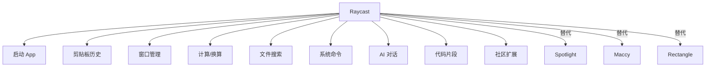
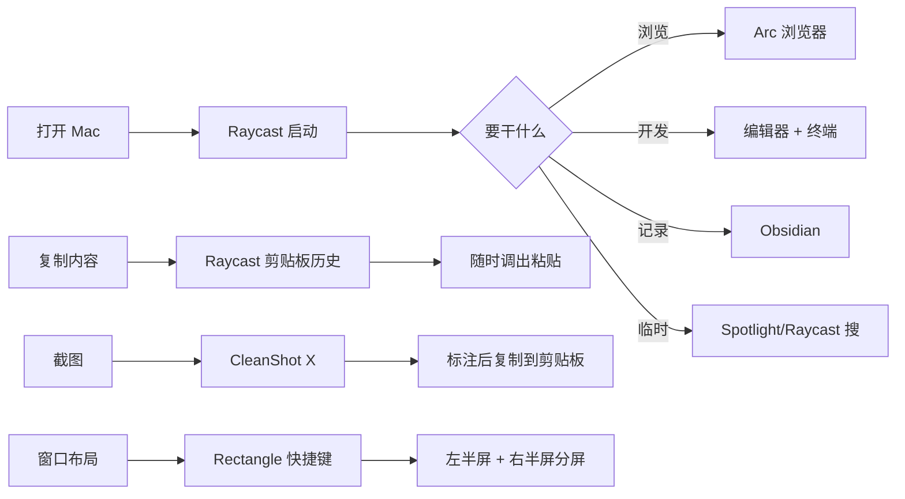

# 4. 效率工具链 {#efficiency}

macOS 自带功能够用，但装对工具可以让效率翻倍。这一章讲我每天在用的效率工具和工作流。

## 4.1 Raycast —— Mac 效率中枢

如果你只装一个第三方工具，装 Raycast。

| 功能 | 怎么用 | 替代了什么 |
| --- | --- | --- |
| 启动器 | `Option + Space`（自定义）输入 App 名 | Spotlight |
| 剪贴板历史 | `Shift + Command + C` | Maccy |
| 窗口管理 | 装 Rectangle 扩展，`Option + 方向键` | Rectangle |
| 计算器 | 直接输入算式 | 计算器 App |
| 单位换算 | 输入 `10 usd`、`20 cm` | 网页搜索 |
| 文件搜索 | 输入文件名 | Finder |
| 系统命令 | `sleep`、`lock`、`empty trash` | 菜单操作 |
| AI 对话 | Pro 版，选中文字直接问 | ChatGPT 网页 |
| 代码片段 | 存常用代码，搜出来粘贴 | Snippet 工具 |
| 扩展插件 | 社区几百个扩展 | 各种小工具 |

## 4.2 快捷指令（Shortcuts）

macOS 自带的自动化工具。可以把多步操作打包成一个快捷指令，一键执行。

| 场景 | 示例 |
| --- | --- |
| 一键开工作模式 | 打开浏览器 + 编辑器 + 终端 + 关通知 |
| 一键截屏上传 | 截图 + 压缩 + 上传 + 复制链接 |
| 批量重命名 | 选中多个文件，按规则改名 |
| 图片处理 | 批量压缩、转格式、调尺寸 |
| 定时执行 | 每天早上自动打开日历和邮件 |

入门路径：启动台 → 快捷指令 App → 图库 → 点 + 新建。或者直接用系统自带的快捷指令模板。

## 4.3 窗口管理

macOS 自带的分屏（长按绿色按钮）效率不够，推荐用工具：

| 工具 | 价格 | 特点 |
| --- | --- | --- |
| Rectangle | 免费开源 | 键盘快捷键为主，够用 |
| Rectangle Pro | 买断 | 布局记忆、拖到手势、跨显示器 |
| AeroSpace | 免费开源 | i3 风格自动平铺、工作区和配置文件，键盘党优先 |
| Amethyst | 免费开源 | 老牌自动平铺方案，已有配置可继续用 |
| Raycast + Rectangle 扩展 | 免费 | 在 Raycast 里直接窗口管理 |

默认选 Rectangle；只有当你明确需要“窗口自动排布 + 多工作区 + 配置即代码”时再上 AeroSpace。两类工具的心智模型不同，不需要一起常驻。

我最常用的 Rectangle 快捷键：

| 快捷键 | 作用 |
| --- | --- |
| `Option + Command + ←` | 左半屏 |
| `Option + Command + →` | 右半屏 |
| `Option + Command + ↑` | 最大化（不进全屏） |
| `Option + Command + ↓` | 还原 |
| `Option + Command + C` | 居中 |
| `Option + Command + Return` | 进全屏 |

## 4.4 菜单栏管理

菜单栏空间有限，图标多了挤成一团。

| 工具 | 价格 | 特点 |
| --- | --- | --- |
| Ice | 免费开源 | 折叠不常用图标，5 分钟就上手 |
| Bartender | 买断 | 老牌工具，功能更多 |
| Hidden Bar | 免费开源 | Ice 的前身 |

## 4.5 我的效率工作流

