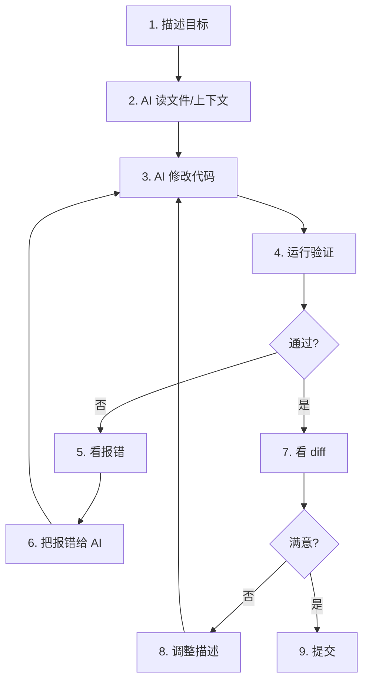

<script setup>
import { Package, Command, Share2, Zap, Code, Wrench, Shield, ArrowRightLeft, Trash2, Globe, FolderSync, Monitor, Radio, Clipboard, Clapperboard, NotebookPen, Terminal, Bot } from '@lucide/vue'
</script>

# 5. 开发与 AI {#dev-ai}

## 5.1 终端基础

用 Mac 做开发绕不开终端。几个基本概念：

| 词 | 意思 |
| --- | --- |
| Terminal | 打开命令行的 App；系统自带版够入门，想升级优先试 Ghostty |
| Shell | 接收命令的程序，macOS 默认 zsh |
| 当前目录 | 命令执行的位置 |
| PATH | 系统查找命令的路径列表 |
| Homebrew | macOS 的包管理器 |
| Git | 代码版本管理 |
| SSH | 远程登录和代码平台认证 |

最小命令集：

```bash
pwd                 # 当前目录
ls                  # 列文件
ls -la              # 列所有文件（含隐藏），显示详情
cd /some/dir        # 进目录
cd ~                # 回家目录
cd -                # 回上一个目录
mkdir myproject     # 新建目录
touch file.txt      # 新建文件
cat file.txt        # 看文件内容
grep "keyword" file # 搜内容
echo $PATH          # 看 PATH
which node          # 看命令在哪
man ls              # 看命令手册（q 退出）
```

## 5.2 Homebrew {#homebrew}

macOS 的包管理器。装命令行工具和图形界面 App 都用它。

```bash
# 安装 Homebrew
/bin/bash -c "$(curl -fsSL https://raw.githubusercontent.com/Homebrew/install/HEAD/install.sh)"

# 装 CLI 工具
brew install git
brew install node
brew install python

# 装图形界面 App（--cask）
brew install --cask vscode
brew install --cask raycast
brew install --cask obsidian

# 常用命令
brew search node             # 搜索
brew list                    # 看已装
brew upgrade                 # 更新全部
brew cleanup                 # 清旧版本缓存
brew info git                # 看包信息
brew uninstall git           # 卸载
```

::: tip Brewfile
可以把所有已装的包导出一个文件，换 Mac 时一条命令复刻环境：
```bash
brew bundle dump --file=~/Brewfile    # 导出
brew bundle install --file=~/Brewfile # 恢复
```
:::

## 5.3 Git

```bash
# 第一次用先配
git config --global user.name "你的名字"
git config --global user.email "你的邮箱"

# 设默认分支名
git config --global init.defaultBranch main

# 让常用命令有颜色
git config --global color.ui auto
```

日常流程：

```bash
git status              # 看状态
git add .               # 暂存所有改动
git commit -m "说明"     # 提交
git push                # 推到远程
git pull                # 拉最新
git log --oneline -10   # 看最近 10 条提交
git diff                # 看未暂存的改动
git diff --staged       # 看已暂存的改动
git checkout -b feature # 新建并切到分支
git merge feature       # 合并分支到当前
```

## 5.4 SSH

```bash
# 生成 key
ssh-keygen -t ed25519 -C "你的邮箱"

# 复制公钥到 GitHub → Settings → SSH and GPG keys
cat ~/.ssh/id_ed25519.pub | pbcopy    # pbcopy 直接复制到剪贴板

# 测试
ssh -T git@github.com
```

多服务器用 `~/.ssh/config` 管理：

```text
Host github.com
  HostName github.com
  User git
  IdentityFile ~/.ssh/id_ed25519

Host myserver
  HostName 1.2.3.4
  User ubuntu
  IdentityFile ~/.ssh/id_server
  Port 2222

Host nas
  HostName 192.168.1.100
  User admin
  IdentityFile ~/.ssh/id_nas
```

之后 `ssh myserver` 直连，不用记 IP 和端口。

## 5.5 开发环境清单

| 能力 | 工具 | 备注 |
| --- | --- | --- |
| 包管理 | Homebrew | 先装这个 |
| 版本管理 | Git | |
| 代码编辑 | VS Code / Cursor / TRAE | Cursor、TRAE 都是 AI IDE 路线 |
| 终端 | Ghostty / iTerm2 | 新装优先 Ghostty；需要成熟 profile 和热键窗口选 iTerm2 |
| 远程认证 | SSH key | |
| 浏览器 | Arc / Brave | 开发用 Chrome 内核 |
| Node 版本管理 | fnm / nvm | 多项目切版本 |
| Python 版本管理 | pyenv | 多项目切版本 |

## 5.6 AI Coding 工作流

我的 AI Coding 工作流：

常见工具先这么分：

| 工具 | 适合场景 | 注意 |
| --- | --- | --- |
| Cursor | VS Code 生态 + AI 改代码 | 生态成熟，订阅成本要算 |
| TRAE / TRAE CN | 想试免费或国内模型的 AI IDE | 国际版和国内版分开看，别混着评估 |
| VS Code / VSCodium | 插件生态和传统开发 | AI 能力靠插件补 |
| Zed | 追求轻快和现代编辑体验 | 插件生态还在长 |



给 AI 的信息格式（越具体越好）：

```text
项目目录：~/code/macos-playbook
目标：把本站改成 8 模块结构
限制：不要拆二级页面，保持单页
验证：最后运行 pnpm run build
```

报错时复制文本，不要发截图。格式：

```text
我运行的命令：
pnpm run build

报错内容：
[粘贴完整错误]

我期望：
构建通过
```

必须截图时，补三句话：

```text
我现在在哪个 App：Safari
我想完成什么：把页面导出成 PDF
异常是什么：菜单里找不到导出选项
```

::: warning AI Coding 常见坑
1. **上下文不够**：AI 只看到你给的文件。改一个功能可能要让它先读 3-5 个相关文件。
2. **改了不该改的**：每次让 AI 改完，先看 diff 再提交。`git diff` 是你的朋友。
3. **死循环报错**：AI 修了 A 又坏了 B，修了 B 又坏了 A。这时候停下来，自己读完代码再说。
4. **不要让 AI 未经授权直接 push**：默认先看 diff、跑验证；在可信仓库里，如果你已经明确要求发布，并约定了检查、提交和回滚边界，可以让 AI 完成 commit、push 和 deploy。
:::

## 5.7 我的配置文件

### ~/.zshrc

```bash
# Homebrew
eval "$(/opt/homebrew/bin/brew shellenv)"

# PATH
export PATH="$HOME/bin:$PATH"

# 别名
alias ll="ls -la"
alias gs="git status"
alias gd="git diff"
alias gc="git commit -m"
alias gp="git push"
alias gl="git log --oneline -10"
alias ..="cd .."
alias ...="cd ../.."

# 历史记录
HISTSIZE=10000
SAVEHIST=10000

# 提示符（简单版）
PROMPT='%F{blue}%~%f %F{green}❯%f '
```

### ~/.gitconfig

```text
[user]
  name = 你的名字
  email = 你的邮箱

[init]
  defaultBranch = main

[color]
  ui = auto

[alias]
  st = status
  co = checkout
  br = branch
  ci = commit
  lg = log --oneline --graph --all

[pull]
  rebase = false
```

## 5.8 Brewfile 示例

```text
# Brewfile
# 一键恢复：brew bundle install --file=~/Brewfile

# CLI 工具
brew "git"
brew "node"
brew "fnm"
brew "python"
brew "ripgrep"
brew "jq"
brew "wget"
brew "tree"

# 图形界面 App
cask "raycast"
cask "rectangle"
cask "ghostty"
cask "visual-studio-code"
cask "obsidian"
cask "arc"
cask "ice"
cask "maccy"
cask "cleanshot-x"
```
