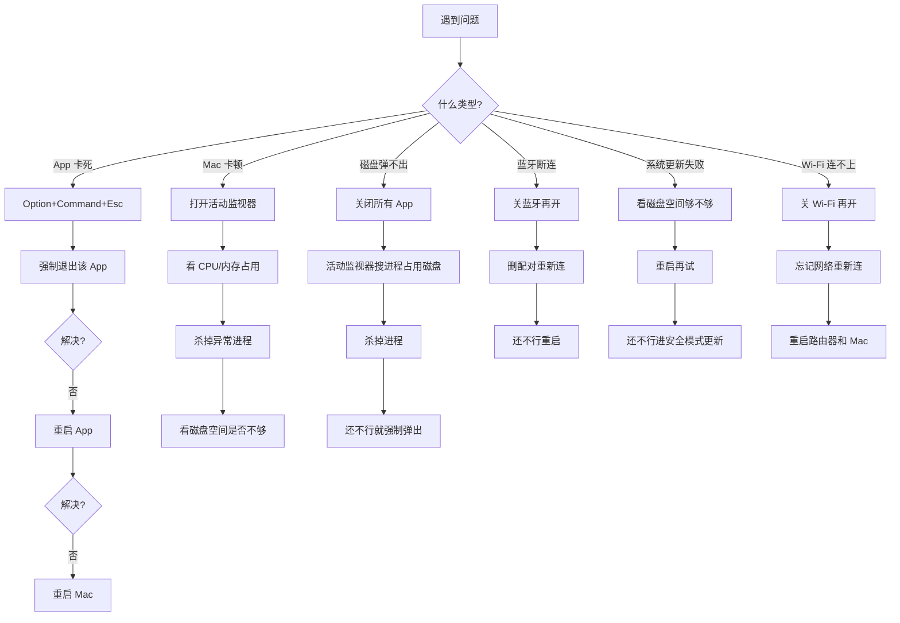

# 6. 系统维护与故障排查 {#maintenance}

## 6.1 活动监视器

macOS 的任务管理器。`Command + Space` 搜 "活动监视器" 打开。

| 标签页 | 看什么 |
| --- | --- |
| CPU | 哪个进程占 CPU 高 |
| 内存 | 哪个进程占内存多，内存压力 |
| 能源 | 哪个 App 费电 |
| 磁盘 | 哪个进程在读写磁盘 |
| 网络 | 哪个进程在用网络 |

::: tip Mac 卡了怎么办
1. `Option + Command + Esc` 打开强制退出窗口
2. 看哪个 App 没响应，选中点强制退出
3. 还卡就打开活动监视器看 CPU 和内存
4. 某个进程占 100% CPU 就杀掉它
5. 还不行就重启（`Control + Command + 电源键`）
:::

## 6.2 登录项与后台进程

有些 App 装完会自动加到登录项，开机就跑，拖慢启动速度。

| 操作 | 路径 |
| --- | --- |
| 看登录项 | 系统设置 → 通用 → 登录项与扩展 |
| 删登录项 | 选中点减号 |
| 看后台进程 | 同一页面下方"允许在后台" |
| 临时禁用 | 开机时按住 Shift 进安全模式 |

## 6.3 磁盘工具

| 功能 | 路径 |
| --- | --- |
| 查看磁盘 | 磁盘工具 App → 左侧选磁盘 |
| 修复权限 | 磁盘工具 → 急救 |
| 格式化 | 磁盘工具 → 抹掉（会清空数据） |
| 挂载/卸载 | 磁盘工具 → 装载/卸载 |

## 6.4 常见故障排查

## 6.5 macOS 更新前检查清单

更新前过一遍这个清单，避免翻车：

| 顺序 | 检查项 | 为什么 |
| --- | --- | --- |
| 1 | Time Machine 备份 | 万一更新出问题能回退 |
| 2 | 磁盘空间至少留 20GB | 更新包 + 临时文件需要空间 |
| 3 | 关闭所有 App | 避免更新中断 |
| 4 | 接电源 | 不要用电池更新 |
| 5 | 查兼容性 | 老软件可能不兼容新系统 |
| 6 | 看社区反馈 | 大版本更新先等几天看别人有没有坑 |

::: warning 大版本更新策略
每年 macOS 一次大更新（如 Sonoma → Sequoia）。我的策略：**等正式版发布后两周再更新**。前两周是社区帮忙找 bug 的时间，别人踩过的坑你看一遍。
:::

## 6.6 月度维护清单

| 任务 | 频率 | 怎么做 |
| --- | --- | --- |
| 清下载文件夹 | 每周 | `~/Downloads` 大文件移走或删 |
| 清废纸篓 | 每周 | `Shift + Command + Delete` |
| 清截图 | 每周 | 截图文件夹删不要的 |
| brew cleanup | 每月 | `brew cleanup` 清旧版本 |
| 检查备份 | 每月 | 确认 Time Machine 在跑 |
| 更新软件 | 每月 | `brew upgrade` + App Store 更新 |
| 清缓存 | 每季 | Xcode: `~/Library/Developer/Xcode/DerivedData` |
| 查磁盘空间 | 每月 | 系统设置 → 存储 |
