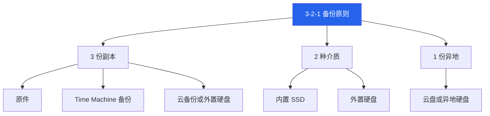
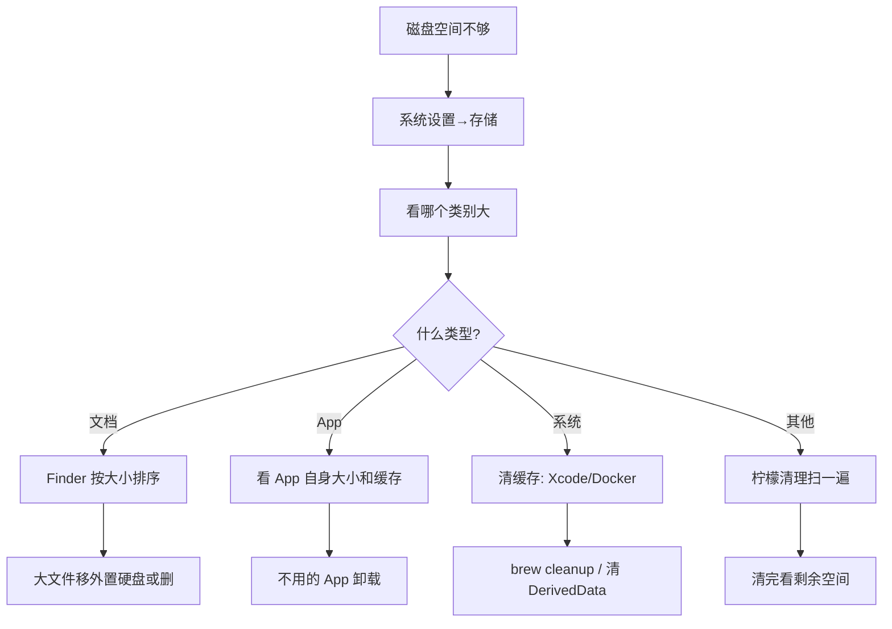

# 7. 安全与备份 {#security-backup}

## 7.1 设备安全

| 目标 | 做法 | 备注 |
| --- | --- | --- |
| 防止别人打开 | 锁屏密码 + Touch ID | 密码别用纯数字 |
| 自动锁屏 | 系统设置 → 锁定屏幕 | 时间设 5 分钟以内 |
| 腕表解锁 | Apple Watch 解锁 Mac | 戴着表靠近就解锁 |
| 保护磁盘 | 开 FileVault | 全盘加密，丢了别人读不了 |
| 找回设备 | Apple ID → 查找我的 Mac | 能定位、发声、远程抹掉 |

## 7.2 隐私与权限

macOS 对权限管控很严格，每个 App 要用摄像头、麦克风都要单独授权。

| 权限 | 在哪看 | 注意 |
| --- | --- | --- |
| 摄像头 | 隐私与安全性 → 摄像头 | 不用的 App 撤掉 |
| 麦克风 | 隐私与安全性 → 麦克风 | 同上 |
| 屏幕录制 | 隐私与安全性 → 屏幕录制 | 截图、录屏、共享屏幕需要 |
| 辅助功能 | 隐私与安全性 → 辅助功能 | 窗口管理、快捷键工具需要 |
| 完全磁盘访问 | 隐私与安全性 → 完全磁盘访问 | 谨慎给，只给信任的 App |
| 位置 | 隐私与安全性 → 定位服务 | 不需要位置的 App 关掉 |
| 通讯录/日历 | 隐私与安全性 → 对应项 | 按需给 |

::: tip 定期检查权限
每季度花 10 分钟过一遍隐私与安全性，把不用的权限撤掉。App 装多了权限容易失控。
:::

## 7.3 软件安全

macOS 默认会拦没经过苹果签名的软件。有两种限制：

| 限制 | 说明 | 怎么处理 |
| --- | --- | --- |
| Gatekeeper | 拦未签名 App | 右键 → 打开（仍要打开） |
| 公证检查 | 拦未经苹果公证的 App | 系统设置 → 隐私与安全性 → 仍要打开 |

::: warning 装软件的安全原则
1. **优先从 App Store 装**：经过苹果审核
2. **其次从官网装**：确认 URL 正确
3. **最后从 Homebrew 装**：开源社区审查
4. **不要从不明来源装**：破解版、盗版风险高
5. **"无法打开"先看权限**：不一定是软件坏了
:::

## 7.4 备份策略 —— 3-2-1 原则

备份数据最重要的原则叫 3-2-1：

| 备份方式 | 能解决什么 | 不能解决什么 | 我的方案 |
| --- | --- | --- | --- |
| iCloud 同步 | 多设备访问同一份文件 | 误删、误覆盖、找回历史版本 | 文档和照片同步 |
| Time Machine | 整机或文件回到之前的样子 | 异地备份 | 外置硬盘自动备份 |
| 手动归档 | 大文件、项目交付、冷资料 | 自动找回历史版本 | 项目完成打包存外置硬盘 |
| 云备份 | 异地容灾 | 大文件慢、隐私顾虑 | 重要文档额外存一份 |

::: danger 最容易踩的坑
**iCloud Drive 不是备份。** 你在 Mac 上删了一个文件，iCloud 会同步删除所有设备上的副本。Time Machine 才能让你回到删除前的状态。
:::

## 7.5 空间管理

空间不够先查占用的源头，不要直接上清理软件：

| 步骤 | 怎么做 |
| --- | --- |
| 1. 看大盘 | 系统设置 → 存储，看哪个类别大 |
| 2. 查大头 | 常见：下载、废纸篓、视频录屏截图、旧安装包 |
| 3. 清缓存 | Xcode: `~/Library/Developer/Xcode/DerivedData` |
| 4. 清 Docker | Docker Desktop → 设置 → 清理 |
| 5. 清 iPhone 备份 | 系统设置 → 通用 → iPhone 存储空间 |
| 6. brew cleanup | 清 Homebrew 旧版本 |
| 7. 看大文件 | Finder 按大小排序，或用柠檬清理扫一遍 |

## 7.6 密码管理

| 方案 | 特点 | 适合谁 |
| --- | --- | --- |
| iCloud 钥匙串 | 系统内置，全设备同步 | 只用 Apple 生态的人 |
| 1Password | 跨平台，功能全，有家庭方案 | 多平台、需要共享密码 |
| Bitwarden | 开源免费 | 技术用户，预算有限 |

我的选择：iCloud 钥匙串处理日常密码，1Password 管理工作和共享密码。
