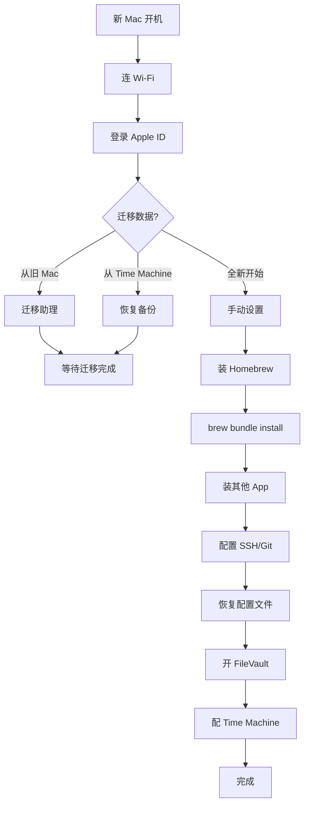

<script setup>
import { Package, Command, Share2, Zap, Code, Wrench, Shield, ArrowRightLeft, Trash2, Globe, FolderSync, Monitor, Radio, Clipboard, Clapperboard, NotebookPen, Terminal, Bot } from '@lucide/vue'
</script>

# 8. 换机与迁移 {#migration}

## 8.1 新 Mac 首次设置



## 8.2 从旧 Mac 迁移

| 方式 | 适合场景 | 速度 |
| --- | --- | --- |
| 迁移助理（Wi-Fi） | 两台 Mac 都在 | 慢，几十 GB 要几小时 |
| 迁移助理（雷电线） | 两台 Mac 有雷雳口 | 快，几百 GB 半小时 |
| Time Machine 恢复 | 旧 Mac 不在身边 | 看硬盘速度 |
| 手动迁移 | 只想搬部分数据 | 看你搬多少 |

::: tip 迁移什么、不迁移什么
**迁移**：文档、配置文件、`~/Library` 里的偏好、SSH key、Brewfile。
**不迁移**：缓存文件、下载文件夹里的垃圾、旧 App 的残留。迁移完新机更容易跑得快。
:::

## 8.3 重装系统

极少数情况下需要重装 macOS（系统损坏、卖二手前）。

| 步骤 | 操作 |
| --- | --- |
| 1. 备份 | Time Machine 完整备份 |
| 2. 抹掉磁盘 | 重启按 `Command + R` → 磁盘工具 → 抹掉 |
| 3. 重装 | 退出磁盘工具 → 重新安装 macOS |
| 4. 恢复数据 | 装完后用迁移助理从 Time Machine 恢复 |

## 8.4 出售/转让前清理

| 顺序 | 操作 |
| --- | --- |
| 1 | 备份所有数据 |
| 2 | 退出 Apple ID（系统设置 → Apple ID → 退出登录） |
| 3 | 退出 iCloud |
| 4 | 关闭 FileVault（让新主人不用等解密） |
| 5 | 抹掉磁盘（`Command + R` → 磁盘工具 → 抹掉） |
| 6 | 重装 macOS |
| 7 | 设为全新状态（设置时关机，不要登录 Apple ID） |

::: danger 不要直接卖
一定要先退出 Apple ID 和 iCloud。否则新主人登不了自己的账号，你的数据可能泄露，"查找我的 Mac"会把机器锁死。
:::

## 8.5 我的 Mac 配置

| 项目 | 我的选择 |
| --- | --- |
| 机器 | MacBook Pro M2 Pro |
| 内存 | 16GB |
| 硬盘 | 512GB SSD |
| 外接显示器 | 27 寸 4K |
| 外接硬盘 | 2TB SSD（Time Machine + 归档） |
| 鼠标 | 罗技 MX Master 3S |
| 键盘 | 外接机械键盘 |
| 扩展坞 | 雷雳 4 扩展坞 |

桌面布局：

```text
┌─────────────────────────────────────────┐
│                                         │
│           27 寸 4K 显示器               │
│         (主屏，编辑器/浏览器)            │
│                                         │
├─────────────────────────────────────────┤
│  MacBook Pro 屏幕  │   iPad (随航)      │
│  (副屏，终端/笔记)  │  (参考文档/通讯)    │
└─────────────────────────────────────────┘
```

## 8.6 真实工作流案例 —— 写一篇技术博客


## 8.7 真实工作流案例 —— 用 AI Coding 改这个项目

```text
1. 打开 Cursor，打开项目目录
2. 用自然语言描述目标：
   "把 macOS Playbook 从 4 模块扩展到 8 模块，
    新增跨设备协作、效率工具链、系统维护、换机迁移。
    保持单页结构，加 Mermaid 流程图。"
3. AI 读 index.md，生成修改方案
4. AI 修改 index.md
5. 我运行 pnpm run build 验证
6. 看报错 → 把报错给 AI → AI 修
7. 循环直到构建通过
8. git diff 看改动
9. git commit && git push
10. Cloudflare 自动部署
```
