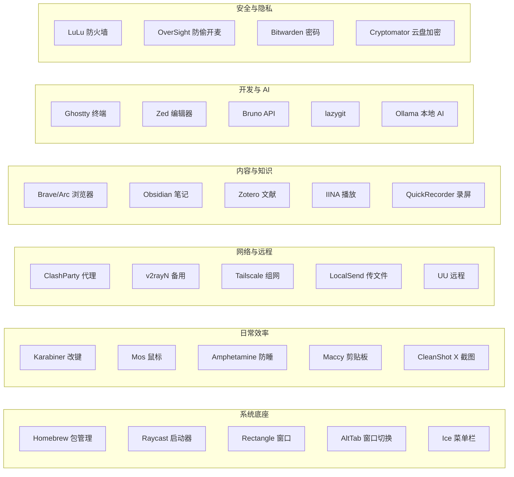
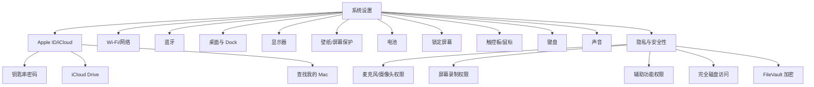
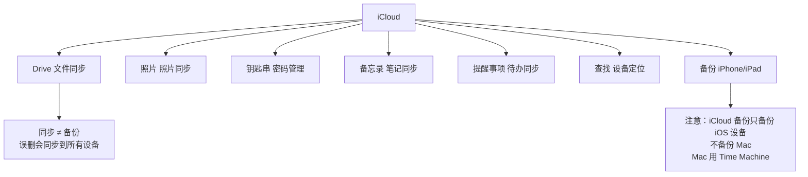
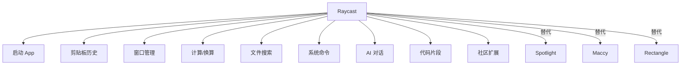
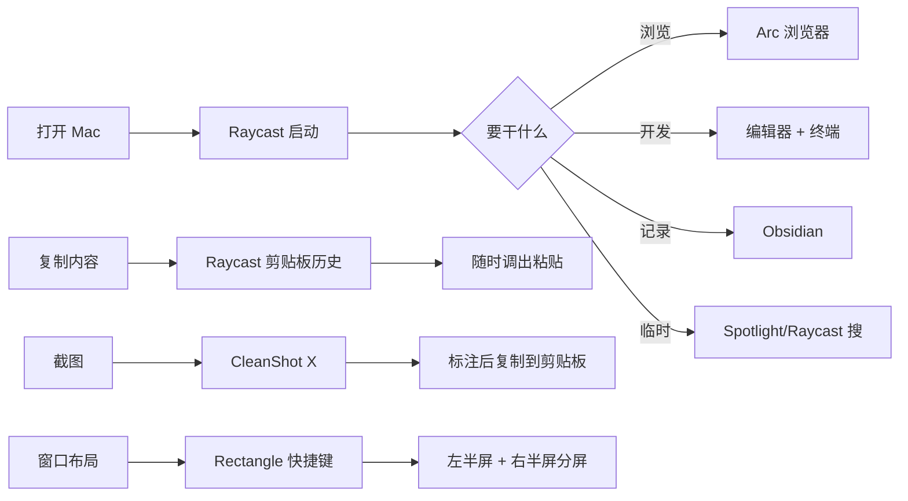
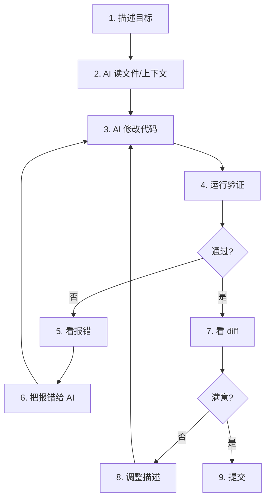
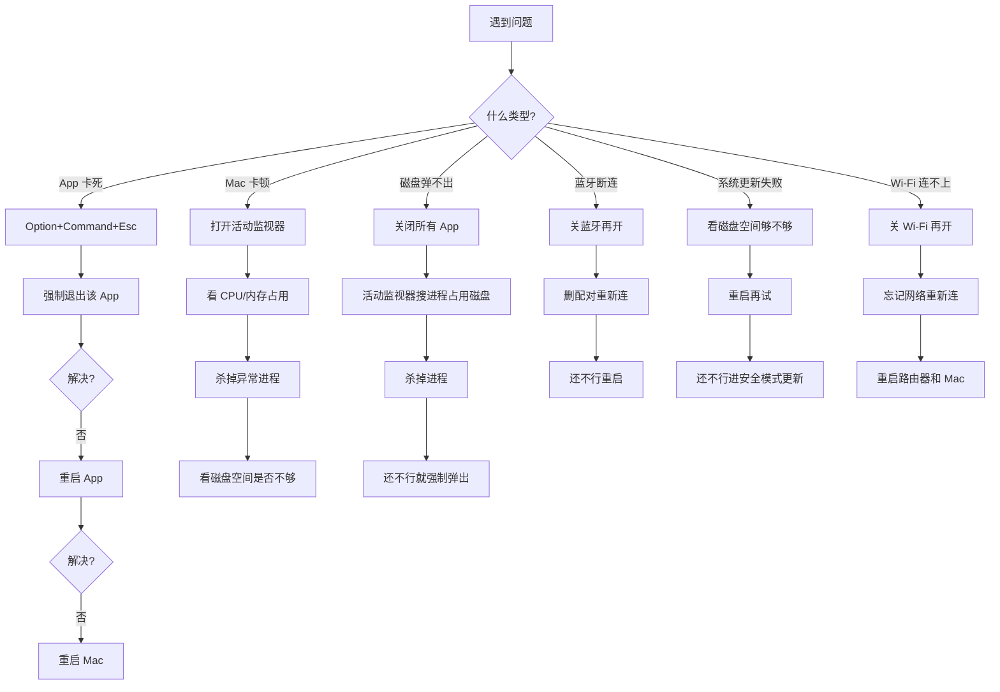
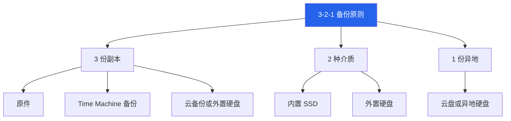
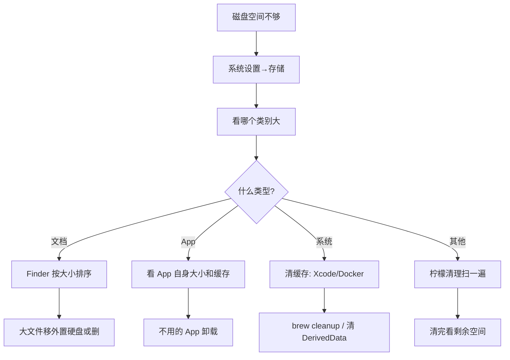
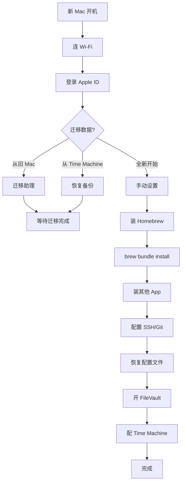

<script setup>
import { Package, Command, Share2, Zap, Code, Wrench, Shield, ArrowRightLeft } from '@lucide/vue'
</script>

<!-- README:START_HIDDEN -->
<section class="onepage-hero">
  <p class="onepage-kicker">macOS Playbook</p>
  <h1 class="onepage-title">macOS 使用手册</h1>
  <p class="onepage-subtitle">从零上手到用顺手——踩过的坑、用顺手的工具、形成的习惯都在这。覆盖软件推荐、系统操作、跨设备协作、效率工具、开发环境、维护排查、安全备份、换机迁移。</p>
</section>

<div class="quick-grid">
  <a href="#software"><div class="card-icon"><Package /></div><div class="card-body"><strong>软件推荐</strong><span>买完 Mac 装什么</span></div></a>
  <a href="#macos"><div class="card-icon"><Command /></div><div class="card-body"><strong>macOS 上手</strong><span>Windows 转换、设置、日常操作</span></div></a>
  <a href="#ecosystem"><div class="card-icon"><Share2 /></div><div class="card-body"><strong>跨设备协作</strong><span>接力、通用剪贴板、随航、AirDrop、安卓联动</span></div></a>
  <a href="#efficiency"><div class="card-icon"><Zap /></div><div class="card-body"><strong>效率工具链</strong><span>Raycast、快捷指令、窗口管理</span></div></a>
  <a href="#dev-ai"><div class="card-icon"><Code /></div><div class="card-body"><strong>开发与 AI</strong><span>终端、Git、SSH、AI Coding</span></div></a>
  <a href="#maintenance"><div class="card-icon"><Wrench /></div><div class="card-body"><strong>系统维护与排查</strong><span>活动监视器、故障排查、更新</span></div></a>
  <a href="#security-backup"><div class="card-icon"><Shield /></div><div class="card-body"><strong>安全与备份</strong><span>权限、加密、3-2-1 备份策略</span></div></a>
  <a href="#migration"><div class="card-icon"><ArrowRightLeft /></div><div class="card-body"><strong>换机与迁移</strong><span>新机设置、旧机迁移、重装、出二手</span></div></a>
</div>
<!-- README:END_HIDDEN -->

> 个人 macOS 使用经验。从 2020 年第一次用 Mac 到现在，踩过的坑、用顺手的工具、形成的习惯，全部记录在这里。

## 1. 软件推荐 {#software}

买完 Mac 先装这些。挑选原则：**免费优先、开源优先**，但好用是硬道理——付费的、闭源的、Electron 的，只要真的顺手都留。同类工具好的可以多备几个，按需装就行，不搞"全家桶"。每款标了我自己的星级和使用频率。

### 1.1 🛠 系统底座与增强

- **[Homebrew](https://brew.sh/)** ★★★★★ · 装机第一件 · [GitHub](https://github.com/Homebrew/brew)

  macOS 软件管理底座。命令行工具、图形 App、开发环境全靠它装。不会 Brew，等于浪费了 Mac 一半的终端能力。详见 [5.2 Homebrew](#homebrew)。

- **[Raycast](https://www.raycast.com/)** ★★★★★ · 日常必用

  Spotlight 的全面上位替代。启动器 + 剪贴板历史 + 窗口管理 + 计算器 + 单位换算 + AI 对话，全塞进一个工具。免费版够用，Pro 版加 AI 和云同步。我装完 Mac 第一个装的就是它，Spotlight 直接关了。

- **[Rectangle](https://rectangleapp.com/)** ★★★★★ · 日常必用 · [GitHub](https://github.com/rxhanson/Rectangle)

  免费开源的窗口管理。`Option + 方向键` 把窗口推到左半屏、右半屏、上半屏、居中、最大化。从 Windows 过来的人装上立刻顺手。进阶可上 Rectangle Pro，支持布局记忆和快捷手势。

- **[AeroSpace](https://nikitabobko.github.io/AeroSpace/guide)** ★★★★☆ · 键盘平铺进阶 · [GitHub](https://github.com/nikitabobko/AeroSpace)

  i3 风格的平铺窗口管理器，用配置文件和键盘工作区管理窗口。适合固定多窗口布局、习惯键盘操作的开发者；普通用户仍先装 Rectangle，别为了“自动平铺”把简单问题复杂化。

- **[AltTab](https://alt-tab.app/)** ★★★★☆ · 多窗口用户刚需 · [GitHub](https://github.com/lwouis/alt-tab)

  让 `Command + Tab` 切换像 Windows 一样能看到具体窗口，而不只是 App 图标。开了一堆窗口的人装上立刻舒服。免费开源。

- **[Ice](https://icemenubar.app/)** ★★★★★ · 常驻 · [GitHub](https://github.com/jordanbaird/Ice)

  菜单栏图标管理。把不常用的菜单栏图标折叠起来，需要时展开。免费开源，Bartender 的平替。菜单栏空间紧张的必装。

- **[Stats](https://mac-stats.com/)** ★★★★☆ · 常驻 · [GitHub](https://github.com/exelban/stats)

  菜单栏系统监控，CPU、GPU、内存、网速、电池、温度都能看。比一堆国产管家清爽。免费开源。

- **[MonitorControl](https://github.com/MonitorControl/MonitorControl)** ★★★★☆ · 外接显示器必装

  接第三方显示器的 Mac 用户基本都该装。用 Mac 的键盘控制外接显示器的亮度和音量，不用再伸手按显示器按钮。免费开源。

- **[BetterDisplay](https://betterdisplay.pro/)** ★★★★☆ · 按需 · [GitHub](https://github.com/waydabber/BetterDisplay)

  外接屏、HiDPI、虚拟屏、显示器调校的高级工具。免费版能用，深度功能偏付费。外接屏有疑难杂症再上它。

- **[Amphetamine](https://apps.apple.com/us/app/amphetamine/id937984704?mt=12)** ★★★★☆ · 日常使用

  防止 Mac 自动睡着的工具。可以设时长、指定某个 App 开着就不睡、下载时不睡、接了外接显示器不睡。免费，没广告没内购。想要更轻的开源替代看 [KeepingYouAwake](https://github.com/newmarcel/KeepingYouAwake)。

### 1.2 ⌨️ 键盘与鼠标

- **[Karabiner-Elements](https://karabiner-elements.pqrs.org/)** ★★★★★ · 重度用户迟早要碰 · [GitHub](https://github.com/pqrs-org/Karabiner-Elements)

  macOS 最强键盘改键工具。简单改键、复杂规则、外接键盘适配都能搞。Caps Lock 改 Ctrl、F 键重映射、按 App 切换布局都靠它。免费开源。

- **[Mos](https://mos.caldis.me/)** ★★★★☆ · 外接鼠标必装 · [GitHub](https://github.com/Caldis/Mos)

  外接鼠标滚轮发涩就装这个。让普通鼠标也有触控板那种顺滑手感，每个 App 还能单独调滚动曲线和按键。免费开源。

- **[LinearMouse](https://linearmouse.app/)** ★★★★☆ · 鼠标用户 · [GitHub](https://github.com/linearmouse/linearmouse)

  鼠标滚动方向、速度、加速度、按键映射都能调，比系统设置像个人类写的东西。和 Mos 二选一或一起用都行。免费开源。

- **[Hammerspoon](https://www.hammerspoon.org/)** ★★★★☆ · 进阶自动化 · [GitHub](https://github.com/Hammerspoon/hammerspoon)

  用 Lua 脚本控制 macOS，窗口、快捷键、Wi-Fi、剪贴板都能自动化。很强，但需要愿意写点脚本。免费开源。

- **[Espanso](https://espanso.org/)** ★★★★☆ · 高频输入利器 · [GitHub](https://github.com/espanso/espanso)

  跨平台文本扩展工具。敲 `:mail` 自动展开成邮箱、`:sig` 展开成签名、代码片段模板都能搞。写作和客服式高频输入很爽。免费开源。

- **[MeetingBar](https://github.com/leits/MeetingBar)** ★★★★☆ · 会议多的人

  菜单栏显示当前/下一个会议，一键进会议。适合会议多的人。免费开源。

### 1.3 🧹 清理与卸载

- **[腾讯柠檬清理](https://lemon.qq.com/)** ★★★★☆ · 偶尔用 · [GitHub](https://github.com/Tencent/lemon-cleaner)

  腾讯出的 Mac 清理工具。能清垃圾、卸载 App、找大文件和重复文件、看磁盘占用，菜单栏还能显示 CPU、内存这些状态。国产工具里算顺手的。

- **[Mole](https://mole.fit/)** ★★★★☆ · 偶尔用 · [CLI](https://github.com/tw93/Mole)

  命令行版免费开源，图形界面版买断制。能清理、卸载、分析磁盘、菜单栏实时看状态。tw93 出品，审美在线。

- **[AppCleaner](https://freemacsoft.net/appcleaner/)** ★★★★☆ · 卸载 App 必备

  卸载 App 时清理残留文件，简单、稳定、够用。免费。和 Mole 的卸载功能可以二选一。

### 1.4 🌐 网络与代理

- **[ClashParty / Mihomo Party](https://clashparty.org/)** ★★★★★ · 常驻 · [GitHub](https://github.com/mihomo-party-org/clash-party)

  代理工具，界面比原版 Clash 友好很多。支持主题、自定义覆写、用 WebDAV 备份配置、Sub-Store 管理订阅。

- **[v2rayN](https://v2rayn.2dust.link/)** ★★★★☆ · 备用 · [GitHub](https://github.com/2dust/v2rayN)

  老牌代理工具，Windows、Mac、Linux 都能用。支持 Xray、sing-box 等核心，下载页直接有 macOS 安装包。当主力代理的备用方案很合适。

- **[Tailscale](https://tailscale.com/)** ★★★★★ · 常驻

  把你各种设备组进一个虚拟内网。装上登录同一个账号，就能远程连家里电脑、NAS、服务器，不用管端口转发那些麻烦事。

### 1.5 📂 文件传输与同步

- **[LocalSend](https://localsend.org/)** ★★★★★ · 局域网传文件首选 · [GitHub](https://github.com/localsend/localsend)

  跨平台局域网文件传输，不走云端，不需要互联网。安卓、Windows、Mac、iPhone 之间传文件很好用。AirDrop 的跨平台版。免费开源。

- **[Syncthing](https://syncthing.net/)** ★★★★☆ · 多设备同步 · [GitHub](https://github.com/syncthing/syncthing)

  多设备文件同步，数据全在自己设备上，不走第三方云。适合替代一部分网盘同步需求。配置略有门槛。免费开源。

- **[Cyberduck](https://cyberduck.io/)** ★★★★☆ · 云存储管理

  FTP、SFTP、WebDAV、S3、R2、OneDrive、Google Drive 都能连。云存储和服务器文件管理很好用。免费开源。

- **[Keka](https://www.keka.io/)** ★★★★☆ · 压缩解压必备 · [GitHub](https://github.com/aonez/Keka)

  macOS 压缩/解压工具，格式支持全。官网免费下载，App Store 付费版用来支持作者。

### 1.6 🖥 浏览器

- **[Brave](https://brave.com/)** ★★★★☆ · 日常使用

  主打隐私的浏览器。自带广告和追踪拦截，连 YouTube 的视频广告和前贴片都能挡掉。Chromium 内核，Chrome 插件直接能用。

- **[Arc](https://arc.net/)** ★★★★★ · 日常主力

  重新设计的浏览器。侧边栏标签、Space 分隔工作和生活、内置笔记和分屏、标签自动归档。用习惯之后回不去 Chrome。免费。

- **[Firefox](https://www.firefox.com/)** ★★★★☆ · 独立阵营

  独立浏览器阵营，扩展生态和隐私控制都不错。不想全押 Chromium 的人留一个。隐私洁癖可以上 [LibreWolf](https://librewolf.net/)（Firefox 去遥测强化版）。想要原生 Mac 体验的可以试 [Orion](https://kagi.com/orion/)（WebKit，非开源，支持 Chrome/Firefox 扩展）。

### 1.7 ⌨️ 输入法

- **[豆包输入法](https://shurufa.doubao.com/)** ★★★★☆ · 日常使用 · [macOS 下载](https://shurufa.doubao.com/pc)

  字节跳动出的输入法。主打语音输入，方言能识别，说错会自动纠错，还会根据上下文猜你想打什么。

### 1.8 📡 远程与虚拟机

- **[UU 远程](https://uuyc.163.com/)** ★★★★☆ · 偶尔用 · [App Store](https://apps.apple.com/cn/app/uu远程-远程办公-游戏串流/id1642306791)

  网易出的远程桌面。手机、平板、电脑都能远控，延迟低，支持 4K 144 帧，键鼠、手柄、触控都能用，办公和游戏串流都行。不是开源工具，但免费体验很强。

- **[RustDesk](https://rustdesk.com/)** ★★★★☆ · 开源远程桌面 · [GitHub](https://github.com/rustdesk/rustdesk)

  开源远程桌面工具，可自建服务端。适合替代一部分 TeamViewer / AnyDesk 场景。想要完全自控的人选它。

- **[UTM](https://mac.getutm.app/)** ★★★★☆ · 虚拟机 · [GitHub](https://github.com/utmapp/UTM)

  免费开源虚拟机工具，基于 QEMU。跑 Linux、Windows 测试环境很方便。免费开源。

### 1.9 📋 剪贴板与截图录屏

- **[Maccy](https://maccy.app/)** ★★★★★ · 常驻 · [GitHub](https://github.com/p0deje/Maccy)

  轻量剪贴板历史。`Shift + Command + C` 调出，键盘选条目粘贴，纯文本优先，不存图片和大文件所以很快。开源免费。如果你用 Raycast，它的内置剪贴板历史也能用，二选一。

- **[CleanShot X](https://cleanshot.com/)** ★★★★★ · 日常必用

  截图 + 录屏 + 标注 + OCR 一体。截图自动浮在屏幕上不用先存文件，滚动截图整页网页，录屏可以选帧率。买断制，不便宜但值。

- **[Shottr](https://shottr.cc/)** ★★★★☆ · CleanShot 平替

  截图工具，免费可长期用，非开源。Mac 上体验很好。预算有限不想买 CleanShot X 用它。

- **[QuickRecorder](https://lihaoyun6.github.io/quickrecorder/)** ★★★★★ · 轻量录屏 · [GitHub](https://github.com/HaoDong108/QuickRecorder)

  轻量开源录屏神器，macOS 上比很多臃肿录屏软件舒服。日常快速录屏优先用它。

- **[OBS Studio](https://obsproject.com/)** ★★★★☆ · 录屏直播全能 · [GitHub](https://github.com/obsproject/obs-studio)

  录屏、直播、多场景、音频混流全能。功能强，但日常快速录屏不如 QuickRecorder 轻。需要直播或复杂场景再上它。免费开源。

### 1.10 🎬 媒体处理

- **[IINA](https://iina.io/)** ★★★★★ · 视频播放器 · [GitHub](https://github.com/iina/iina)

  macOS 最舒服的视频播放器之一，基于 mpv，原生感强。免费开源。

- **[HandBrake](https://handbrake.fr/)** ★★★★☆ · 视频转码 · [GitHub](https://github.com/HandBrake/HandBrake)

  视频转码工具，把大视频压小、转格式都很好用。免费开源。

- **[LosslessCut](https://losslesscut.app/)** ★★★★☆ · 无损剪辑 · [GitHub](https://github.com/mifi/lossless-cut)

  无损裁剪视频/音频，不重新编码，剪素材非常快。免费开源。

- **[ImageOptim](https://imageoptim.com/mac)** ★★★★☆ · 图片压缩 · [GitHub](https://github.com/ImageOptim/ImageOptim)

  图片压缩工具，做网站、公众号、博客都该用。免费开源。

- **[BlackHole](https://existential.audio/blackhole/)** ★★★★☆ · 按需 · [GitHub](https://github.com/ExistentialAudio/BlackHole)

  macOS 虚拟声卡，录系统声音、音频路由很有用。免费开源。

- **[Audacity](https://www.audacityteam.org/)** ★★★★☆ · 按需 · [GitHub](https://github.com/audacity/audacity)

  免费开源音频编辑器，录旁白、剪音频够用。

- **画图与设计（按需）**：[Krita](https://krita.org/)（绘画/插画，开源）、[GIMP](https://www.gimp.org/)（图片编辑，开源，体验硬核）、[Inkscape](https://github.com/inkscape/inkscape)（矢量图/SVG，开源）、[Blender](https://www.blender.org/)（3D，开源，功能非常强）。一般人用不上，一旦需要就很值。

### 1.11 📝 知识与办公

- **[Obsidian](https://obsidian.md/)** ★★★★★ · 日常主力 · [Web Clipper](https://obsidian.md/clipper)

  本地优先的笔记软件。所有数据存在本地，文件就是纯 Markdown，不怕被平台锁死。插件生态丰富。官方 Web Clipper 能把网页、高亮存进笔记库。已有知识库就别为了"开源洁癖"硬迁移，折腾自己没必要。

- **[Typora](https://typora.io/)** ★★★★☆ · 单文件 Markdown 写作

  所见即所得的 Markdown 编辑器，适合写单篇文章、README、长文草稿。它不是知识库，更像一把顺手的 Markdown 写字刀：打开快、预览舒服、导出也省心。付费买断，先试用，喜欢再买。

- **[Zotero](https://www.zotero.org/)** ★★★★★ · 读论文/写文章必装 · [GitHub](https://github.com/zotero/zotero)

  文献管理神器，收集、整理、引用、批注都强。读论文、写文章、做研究都该装。免费开源。

- **[NetNewsWire](https://netnewswire.com/)** ★★★★☆ · 信息摄入 · [GitHub](https://github.com/Ranchero-Software/NetNewsWire)

  免费开源 RSS 阅读器，原生、干净、无算法投喂。信息摄入工具里很值得推荐。

- **[Skim](https://skim-app.sourceforge.io/)** ★★★★☆ · PDF 批注

  PDF 阅读和批注工具，特别适合读论文。免费开源。

- **[ima.copilot](https://ima.qq.com/)** ★★★★☆ · 国内 AI 知识库

  腾讯出的 AI 工作台，偏"搜、读、写 + 知识库"。如果你的资料大量来自微信公众号、网页、会议录音、中文文档，它会比纯聊天机器人更顺手。注意它是云端产品，私密资料、客户资料、公司内部文档不要无脑往里丢。

- **Obsidian 替代（按需）**：[Logseq](https://logseq.com/)（本地优先、大纲式、开源）、[Joplin](https://joplinapp.org/)（开源、支持同步加密）。不想用 Obsidian 的人可以看，但已经有 Obsidian 就别折腾。

- **办公套件（按需）**：[LibreOffice](https://www.libreoffice.org/)（开源，UI 传统）、[ONLYOFFICE](https://www.onlyoffice.com/)（Office 格式兼容更友好，界面更现代）。临时打开 Office 文档够用。

### 1.12 📺 终端与开发工具

> 这一类是开发向的，详细用法和配置见 [第 5 节：开发与 AI](#dev-ai)。这里只列工具清单。

- **[iTerm2](https://iterm2.com/)** ★★★★☆ · 成熟稳定

  老牌终端，分屏、热键窗口、搜索、shell integration 和 profile 管理都很成熟。已有复杂配置就继续用；新装机想要更轻、更原生，优先看 Ghostty。

- **[Warp](https://www.warp.dev/)** ★★★★☆ · 可选

  现代化终端，把命令行做成 IDE 那样。按块显示输入和输出，搜索历史命令像聊天记录，内置 AI 补全。免费版够用。

- **[Ghostty](https://ghostty.org/)** ★★★★★ · 开发首选 · [GitHub](https://github.com/ghostty-org/ghostty)

  新一代终端，快、原生、GPU 渲染，体验很现代。现在我会优先推荐它，而不是继续抱着 iTerm2 当传家宝。免费开源。

- **[Zed](https://zed.dev/)** ★★★★☆ · 高性能编辑器 · [GitHub](https://github.com/zed-industries/zed)

  Rust 写的高性能代码编辑器，启动快，AI 和协作方向在做。适合愿意尝鲜的开发者。免费开源。

- **[VSCodium](https://vscodium.com/)** ★★★★☆ · 无遥测 VS Code · [GitHub](https://github.com/VSCodium/vscodium)

  VS Code 的自由开源构建版本，去掉微软遥测。生态还是 VS Code 生态。免费开源。

- **[TRAE / TRAE CN](https://www.trae.ai/)** ★★★★☆ · AI IDE 候选

  字节出的 AI IDE。国际版和国内版模型、账号、网络环境不完全一样，可以按使用场景二选一；如果你经常让 AI 读项目、改代码、生成页面，它适合和 Cursor、VS Code 放在同一类里比较。别因为免费就把主力项目全迁过去，先拿小项目试稳定性和模型质量。

- **[Bruno](https://www.usebruno.com/)** ★★★★★ · API 调试首选 · [GitHub](https://github.com/usebruno/bruno)

  Postman 替代品，本地优先、Git 友好、开源。API 调试我会优先推荐它。免费开源。

- **[DBeaver Community](https://dbeaver.io/)** ★★★★☆ · 数据库管理 · [GitHub](https://github.com/dbeaver/dbeaver)

  免费开源数据库管理工具，支持 PostgreSQL、MySQL、SQLite 等。功能全，UI 有点 Java 味。想要更现代的体验看 [Beekeeper Studio](https://www.beekeeperstudio.io/)。

- **[lazygit](https://lazygit.dev/)** ★★★★☆ · 终端 Git UI · [GitHub](https://github.com/jesseduffield/lazygit)

  终端 Git UI 神器。熟悉命令行以后，比 [GitHub Desktop](https://desktop.github.com/) 更快。免费开源。

- **[Colima](https://colima.run/)** ★★★★☆ · Docker Desktop 替代 · [GitHub](https://github.com/abiosoft/colima)

  免费开源的 Docker Desktop 替代方案，轻量，适合本地容器开发。免费开源。

- **命令行神器**（全部 `brew install` 一行装好，详见 [5.2 Homebrew](#homebrew)）：
  - **[ripgrep](https://github.com/BurntSushi/ripgrep)** · 替代 `grep` · 超快文本搜索，写代码找东西必装
  - **[fzf](https://github.com/junegunn/fzf)** · 命令行模糊搜索神器，文件、历史命令、Git 分支都能搜
  - **[fd](https://github.com/sharkdp/fd)** · 替代 `find` · 命令更短，速度更快
  - **[bat](https://github.com/sharkdp/bat)** · 替代 `cat` · 更好看的查看，支持语法高亮和 Git 信息
  - **[zoxide](https://github.com/ajeetdsouya/zoxide)** · 替代 `cd` · 更聪明的跳目录，根据使用频率跳
  - **[eza](https://github.com/eza-community/eza)** · 替代 `ls` · 现代版 ls，颜色、图标、Git 状态更舒服
  - **[yazi](https://yazi-rs.github.io/)** · 终端文件管理器，速度快，适合键盘流
  - **[jq](https://jqlang.org/)** · JSON 处理必备，调 API、看日志、写脚本都离不开

### 1.13 🤖 本地 AI

- **[Ollama](https://ollama.com/)** ★★★★★ · 本地 LLM 底座 · [官网下载](https://ollama.com/download/mac)

  本地模型运行底座。开发者玩本地 LLM 基本绕不开。免费。

- **[Open WebUI](https://docs.openwebui.com/)** ★★★★☆ · 自托管 AI 工作台 · [GitHub](https://github.com/open-webui/open-webui)

  给 Ollama / OpenAI 兼容 API 套一个自托管 Web UI。适合本地 AI 工作台。免费开源。

- **[Jan](https://jan.ai/)** ★★★★☆ · 友好 GUI · [GitHub](https://github.com/janhq/jan)

  开源本地 AI 助手，GUI 体验比纯命令行友好。想轻松跑本地模型的人用它。免费开源。

- **[LM Studio](https://lmstudio.ai/)** ★★★★☆ · 按 GUI 选

  免费但闭源，本地模型 GUI 很成熟。不想折腾 Docker 和命令行的人用它。免费。

### 1.14 🔒 安全与隐私

> 这一类详见 [第 7 节：安全与备份](#security-backup)。这里只列工具清单。

- **[LuLu](https://objective-see.org/products/lulu.html)** ★★★★★ · 出站防火墙 · [GitHub](https://github.com/objective-see/LuLu)

  Objective-See 出品的免费开源出站防火墙，能拦截未知 App 往外联网。Mac 安全工具里非常值得装。

- **[OverSight](https://objective-see.org/products/oversight.html)** ★★★★☆ · 防偷开麦/摄像头

  监控摄像头和麦克风调用，防止 App 偷偷开麦开摄像头。免费开源。

- **[Bitwarden](https://bitwarden.com/)** ★★★★☆ · 密码管理 · [GitHub](https://github.com/bitwarden)

  免费版支持无限密码和多设备，跨平台体验好。想要完全本地离线看 [KeePassXC](https://keepassxc.org/)。详见 [7.6 密码管理](#security-backup)。

- **[Cryptomator](https://cryptomator.org/)** ★★★★☆ · 云盘加密 · [GitHub](https://github.com/cryptomator/cryptomator)

  给云盘文件做客户端加密，适合 iCloud、Dropbox、Google Drive、OneDrive。免费开源。更硬核的磁盘加密看 [VeraCrypt](https://veracrypt.io/)。

### 1.15 软件全景



## 2. macOS 上手 {#macos}

### 2.1 Windows → Mac 概念对照

从 Windows 切到 Mac，最大的障碍不是操作，是概念。下面这张表覆盖了大多数困惑：

| Windows 习惯 | macOS 对应 | 区别说明 |
| --- | --- | --- |
| `Ctrl` 是主操作键 | `Command` 是主操作键 | 复制粘贴 `Command + C/V`，不是 `Ctrl` |
| `Alt` 是替代键 | `Option` 是隐藏能力键 | 按住 Option 菜单会多出选项，后面专讲 |
| 开始菜单是启动入口 | Spotlight 是启动入口 | `Command + Space`，搜文件也开 App |
| 资源管理器管文件 | Finder 管文件 | Finder 没有地址栏，有路径栏 |
| 任务栏代表窗口 | Dock 代表 App | Dock 是 App 摆放区，不是窗口列表 |
| `Alt + Tab` 切窗口 | `Command + Tab` 切 App | 同 App 多窗口用 `` Command + ` `` |
| 关窗口就是退出 | 关窗口不退出 App | 红色关闭只关窗口，`Command + Q` 才退出 |
| 任务管理器 | 活动监视器 | `Option + Command + Esc` 快捷强制退出 |
| 控制面板 | 系统设置 | 权限、输入、显示、触控板都在这里 |
| 安装：exe/msi | 安装：dmg/pkg | dmg 拖进 Applications，pkg 像安装向导 |
| 卸载：控制面板 | 卸载：拖到废纸篓 | 残留配置在 `~/Library/Application Support` |
| 右键菜单 | 右键 / 双指点按 | 触控板双指点击 = 右键 |
| 剪贴板历史 | 系统没有 | 装 Maccy 或 Raycast 补 |
| 截图工具 | `Command + Shift + 3/4/5` | 系统自带，不需要装额外工具 |

::: tip 核心认知
macOS 的基本单位是 **App**，不是窗口。一个 App 可以有多个窗口，关掉所有窗口 App 还在跑。这个概念想通了，其他都好说。
:::

### 2.2 初次设置清单

新 Mac开机后按顺序过一遍：

| 顺序 | 设置项 | 建议 | 为什么 |
| --- | --- | --- | --- |
| 1 | Apple ID / iCloud | 登录 | 钥匙串和查找设备必须开 |
| 2 | 触控板 | 开轻点点按 | 默认按压太累，轻点就够了 |
| 3 | 触控板 | 三指拖移按需 | 我用过一年关了，和三指轻点查词冲突 |
| 4 | 键盘 | 检查修饰键 | 外接键盘 Command/Option 经常反 |
| 5 | Dock | 只留高频 App | 自动隐藏开起来，屏幕空间更大 |
| 6 | Finder | 显示路径栏、状态栏、扩展名 | 默认藏太多东西 |
| 7 | 截图 | `Command + Shift + 5` 先试一次 | 改保存位置和延迟计时器 |
| 8 | 锁屏 | 密码 + Touch ID | 时间设短，5 分钟以内 |
| 9 | FileVault | 开 | 全盘加密，丢了别人读不了 |
| 10 | Time Machine | 配上 | 插上硬盘就自动备份 |

### 2.3 全局快捷键

| 操作 | 快捷键 | 备注 |
| --- | --- | --- |
| 开 App 或搜文件 | `Command + Space` | Spotlight，建议换成 Raycast |
| 切换 App | `Command + Tab` | 按住 Shift 反向切 |
| 同 App 切换窗口 | `` Command + ` `` | 同 App 多窗口必备 |
| 关窗口 | `Command + W` | 只关窗口不退出 |
| 退出 App | `Command + Q` | 真正退出 |
| 强制退出 | `Option + Command + Esc` | App 卡死时用 |
| App 偏好设置 | `Command + ,` | 几乎所有 App 通用 |
| 隐藏 App | `Command + H` | 不是最小化，是隐藏 |
| 最小化窗口 | `Command + M` | 收到 Dock 右侧 |
| 新建 | `Command + N` | 新窗口/新文件 |
| 保存 | `Command + S` | |
| 打印 | `Command + P` | |
| 撤销/重做 | `Command + Z` / `Shift + Command + Z` | |
| 全选 | `Command + A` | |
| 查找 | `Command + F` | |

### 2.4 Finder

Finder 是 macOS 的文件管理器，但默认配置藏了很多功能。先打开这些：

```text
Finder → 菜单栏 → 显示
  ✓ 显示路径栏      （底部显示当前路径）
  ✓ 显示状态栏      （底部显示文件数和剩余空间）
  ✓ 显示预览面板    （右侧显示文件预览）
  
Finder → 菜单栏 → Finder → 设置 → 高级
  ✓ 显示所有文件扩展名
  ✓ 已选项目时在废纸篓中显示警告
```

| 操作 | 快捷键/方式 |
| --- | --- |
| 预览文件 | 选中按 `Space`（Quick Look，不用打开 App） |
| 重命名 | 选中按 `Return` |
| 前往路径 | `Command + Shift + G`（直接输入 `/usr/local` 这种路径） |
| 显示隐藏文件 | `Command + Shift + .` |
| 复制路径 | `Option + Command + C` |
| 新建文件夹 | `Command + Shift + N` |
| 删除 | `Command + Delete`（移到废纸篓） |
| 清空废纸篓 | `Shift + Command + Delete` |
| 标签 | 给文件打颜色标签，侧边栏筛选 |
| 智能文件夹 | `Command + Option + N`，按条件自动筛选出来 |
| 标签页 | `Command + T`（Finder 也支持标签页） |
| 多文件预览 | 选中多个按 `Space`，可翻页 |
| 分栏视图 | `Command + 3`（我最常用的视图） |
| 图标视图 | `Command + 1` |
| 列表视图 | `Command + 2` |
| 拖拽文件到路径栏 | 等于移动到那一层 |
| 查看文件夹大小 | `Command + I`（显示简介） |

文件分区建议：

| 区域 | 用途 | 管理原则 |
| --- | --- | --- |
| 桌面 | 临时工作区 | 不要长期堆，周末清一次 |
| 下载 | 临时入口 | 每周清一次，大文件移走 |
| 文稿 | 长期文件 | 按项目分文件夹 |
| iCloud Drive | 多设备同步 | 注意：同步不是备份 |
| 外接硬盘 | 归档、备份 | Time Machine + 手动归档 |

::: warning 踩坑提醒
Finder 的"复制"（`Command + D`）是在同一目录创建副本，不是复制到剪贴板。要复制到别处，用 `Command + C` 然后 `Command + V`（复制）或 `Option + Command + V`（移动）。
:::

### 2.5 窗口与桌面空间

| 操作 | 快捷键/方式 |
| --- | --- |
| 隐藏 App | `Command + H`（隐藏后 `Command + Tab` 切回来） |
| 最小化窗口 | `Command + M` |
| 看全部窗口和桌面 | 触控板三/四指上滑，或 `F3` |
| 切桌面 | `Control + 左/右` |
| 分屏 | 绿色按钮长按，或拖窗口到屏幕边缘 |
| 看当前 App 所有窗口 | 触控板四指下滑 |
| 直接最大化 | 绿色按钮点一下（全屏模式） |

我的桌面分法：

```text
桌面 1：浏览器 + 笔记    （日常浏览和记录）
桌面 2：编辑器 + 终端    （开发工作）
桌面 3：会议 + 资料       （开会时切过来）
全屏：需要专注的任务      （写长文、看文档）
```

::: tip 效率建议
窗口管理用 Rectangle 比 macOS 自带分屏更快。`Option + 方向键` 左半屏、右半屏、居中，比长按绿色按钮快得多。
:::

### 2.6 Spotlight / Raycast

`Command + Space` 不只是搜索框，是整个 Mac 的启动器。如果你装了 Raycast，以下功能都更强大：

| 需求 | Spotlight 输入 | Raycast 额外能力 |
| --- | --- | --- |
| 开 App | `safari`、`terminal` | 同上，但更快 |
| 搜文件 | 文件名、关键词 | 支持模糊匹配和最近文件 |
| 查设置项 | `键盘`、`显示器` | |
| 算数 | `128*7` | 支持更多数学函数 |
| 单位换算 | `10 usd`、`20 cm` | |
| 剪贴板历史 | 不支持 | `Shift + Command + C` 调出 |
| 窗口管理 | 不支持 | 装 Rectangle 扩展 |
| AI 对话 | 不支持 | Pro 版内置 |

### 2.7 截图与录屏

| 场景 | 快捷键 | 备注 |
| --- | --- | --- |
| 截全屏 | `Command + Shift + 3` | 自动保存到桌面 |
| 截区域 | `Command + Shift + 4` | 拖选区域 |
| 截窗口 | `Command + Shift + 4` 后按 `Space` | 光标变成相机，点窗口 |
| 截图录屏面板 | `Command + Shift + 5` | 可以改保存位置、设计时器 |
| 截图进剪贴板 | 以上加按 `Control` | 不存文件，直接粘贴 |

截图后右下角预览缩略图可点开标注，不点自动保存。

::: tip 改截图保存位置
默认截图全堆桌面，很乱。`Command + Shift + 5` → 选项 → 存储到 → 选一个文件夹。我专门建了 `~/Downloads/Screenshots`。
:::

### 2.8 文本编辑快捷键

| 场景 | 快捷键 |
| --- | --- |
| 跳行首/行尾 | `Command + 左/右` |
| 跳文档开头/结尾 | `Command + 上/下` |
| 按词移动光标 | `Option + 左/右` |
| 按词选择 | `Shift + Option + 左/右` |
| 选到行首/行尾 | `Shift + Command + 左/右` |
| 选到文档开头/结尾 | `Shift + Command + 上/下` |
| 删左侧一个词 | `Option + Delete` |
| 删到行首 | `Command + Delete` |
| 删到行尾 | `Control + K` |
| 粘贴匹配样式 | `Option + Shift + Command + V` |

### 2.9 Option 键的隐藏能力

Option 是 macOS 上最有意思的键。按住它，菜单和操作会变出额外选项：

| 场景 | 不按 Option | 按住 Option |
| --- | --- | --- |
| 菜单栏 Apple 图标 | "退出 App" | "强制退出 App" |
| Dock 分隔线 | 进 App 偏好设置 | 直接进调度中心 |
| 关闭按钮（红色） | 关当前窗口 | 关当前 App 所有窗口 |
| 音量图标 | 调音量 | 直接进声音设置 |
| Wi-Fi 图标 | 开关 Wi-Fi | 显示 IP、MAC 等详细信息 |
| 蓝牙图标 | 开关蓝牙 | 显示蓝牙详细信息 |
| 拖拽文件 | 移动 | 变成复制（出现 + 号） |
| 粘贴文件 | `Command + V` 复制 | `Option + Command + V` 移动 |
| 光标拖拽选文本 | 正常选择 | 矩形区域选择 |

::: tip 记住一个习惯
看到菜单想找更多选项，先按住 Option 试试。macOS 很多隐藏功能都挂在 Option 键上。
:::

### 2.10 触控板

Mac 触控板在笔记本里是公认的好用。但默认设置没有全开。

| 手势 | 作用 | 在哪开 |
| --- | --- | --- |
| 轻点点按 | 替代按压 | 系统设置 → 触控板 → 轻点来点按 |
| 三指拖移 | 移动窗口、选文本 | 系统设置 → 辅助功能 → 指针控制 → 触控板选项 → 拖移方式 |
| 三指轻点 | 查词 | 系统设置 → 触控板 → 轻点来查词 |
| 双指捏合 | Launchpad | 系统设置 → 触控板 → 更多手势 |
| 双指张开 | 显示桌面 | 同上 |
| 双指滚动 | 页面滚动 | 默认开启 |
| 双指缩放 | 放大缩小 | 默认开启 |
| 双指旋转 | 旋转图片 | 默认开启 |
| 双指从右边缘滑入 | 通知中心 | 默认开启 |

::: warning 三指拖移的取舍
三指拖移很好用——手指不用按下去就能拖窗口、选文本。但它和三指轻点查词冲突。解决方案：把查词改成双指轻点，或者像我一样关掉三指拖移，习惯用力按压拖移。
:::

### 2.11 菜单栏

| 操作 | 方式 |
| --- | --- |
| 重排图标 | 按住 `Command` 拖拽 |
| 移除图标 | 按住 `Command` 拖出菜单栏 |
| 进对应设置 | `Option + 点击` 音量、Wi-Fi 等图标 |
| 看日期时间 | 默认显示 |
| 看电池百分比 | 系统设置 → 控制中心 → 电池 → 显示百分比 |

菜单栏空间有限，图标太多用 Ice 折叠不常用的。

### 2.12 Dock 进阶

| 操作 | 方式 |
| --- | --- |
| 添加 App 到 Dock | 从 Applications 拖进去 |
| 移除 App | 拖出 Dock（App 没运行时） |
| 调大小 | 系统设置 → 桌面与 Dock → 大小滑块 |
| 自动隐藏 | 系统设置 → 桌面与 Dock → 自动隐藏和显示 Dock |
| 改放大效果 | 系统设置 → 桌面与 Dock → 放大 |
| 拖文件到 Dock 图标 | 用对应 App 打开文件 |
| 右键 App 图标 | 最近打开的文件、选项 |
| `Control + 点击` Dock 分隔线 | Dock 偏好设置快捷入口 |

::: tip 我的 Dock 习惯
Dock 只放 5-6 个高频 App：Finder、浏览器、编辑器、终端、笔记。其他用 Raycast 启动。Dock 自动隐藏，把屏幕空间让给内容。
:::

### 2.13 系统设置地图

macOS 的系统设置像一个总控制台，这里列出最常用的入口：



## 3. 跨设备协作 {#ecosystem}

Apple 生态最香的部分。如果你同时有 iPhone、iPad、Apple Watch，这些功能能让你的设备像一台机器一样配合。

### 3.1 接力（Handoff）

在 iPhone 上干到一半的事，Mac 上接着干。反过来也行。

| 条件 | 要求 |
| --- | --- |
| 账号 | 所有设备登录同一个 Apple ID |
| 蓝牙/Wi-Fi | 都打开 |
| 距离 | 在彼此附近（蓝牙范围） |

支持接力的 App：Safari、邮件、备忘录、提醒事项、地图、信息、日历、Keynote、Pages、Numbers。

使用方式：Mac Dock 底部会出现一个带 App 图标的图标，点一下就接力。

### 3.2 通用剪贴板

在 iPhone 上复制，在 Mac 上粘贴。反过来也行。

::: tip 使用条件
和接力一样：同一 Apple ID、蓝牙和 Wi-Fi 都开、设备在附近。不需要任何设置，直接复制粘贴就行。如果偶尔不灵，重启蓝牙和 Wi-Fi。
:::

### 3.3 随航（Sidecar）

把 iPad 变成 Mac 的第二块屏幕。有线或无线都行。

| 用途 | 场景 |
| --- | --- |
| 扩展桌面 | 多一块屏幕放参考文档 |
| 镜像屏幕 | 给别人演示 |
| 绘画板 | 用 Apple Pencil 在 iPad 上画，直接进 Mac |

开启：系统设置 → 显示器 → 添加显示器 → 选你的 iPad。

### 3.4 通用控制（Universal Control）

一套键盘鼠标控制多台 Mac 和 iPad。光标从一台 Mac 的屏幕边缘滑出去，就到了另一台 Mac 上。

| 和随航的区别 | 说明 |
| --- | --- |
| 随航 | iPad 是 Mac 的副屏，共享 Mac 的画面 |
| 通用控制 | 每台设备是独立的，只共享键鼠 |

::: tip 我的使用场景
 MacBook 接显示器做主屏，iPad 用通用控制放旁边看文档。光标拖过去就能在 iPad 上操作，拖文件也行。比远程桌面快。
:::

### 3.5 AirDrop

Apple 设备之间传文件，不需要网络，不需要数据线。

| 操作 | 方式 |
| --- | --- |
| 发送 | 文件右键 → 共享 → AirDrop → 选设备 |
| 接收 | 弹窗点接受 |
| 从 iPhone 发到 Mac | 照片/文件 → 分享 → AirDrop → 选你的 Mac |

::: tip AirDrop 不灵的时候
1. 检查双方都开了 Wi-Fi 和蓝牙
2. 检查接收方的 AirDrop 设置不是"仅联系人"（改成"所有人"试试）
3. 都关一次 Wi-Fi 和蓝牙再开
4. 实在不行，重启
:::

### 3.6 iPhone 手机热点

Mac 和 iPhone 之间的热点是自动的，不需要在 iPhone 上手动开热点。

| 条件 | 要求 |
| --- | --- |
| 账号 | 同一个 Apple ID |
| 蓝牙/Wi-Fi | 都打开 |
| 距离 | 在附近 |

使用：Mac 菜单栏 Wi-Fi 图标 → 列表里直接看到你的 iPhone 个人热点 → 点击连接。

### 3.7 iMessage 和短信转发

在 Mac 上收发 iPhone 的短信和 iMessage。

| 类型 | 说明 |
| --- | --- |
| iMessage | Apple 设备之间，走网络，免费 |
| SMS 短信 | 通过 iPhone 转发，需要在 iPhone 上开 |

开启：iPhone 设置 → 信息 → 文字信息转发 → 选你的 Mac。

### 3.8 iCloud 生态

iCloud 不只是云盘，是一套同步系统。了解每个部分干嘛的：

| 服务 | 同步什么 | 要点 |
| --- | --- | --- |
| iCloud Drive | 文件 | 多设备访问同一份文件。**不是备份**，误删会同步删 |
| iCloud 照片 | 照片视频 | 全部设备同步。优化存储可以省本地空间 |
| 钥匙串 | 密码 | Safari 和 App 的密码自动填充，全设备同步 |
| 备忘录 | 笔记 | 多设备同步，支持 checklist、表格、加密 |
| 提醒事项 | 待办 | 多设备同步，支持位置和时间提醒 |
| 查找 | 设备定位 | 丢了 Mac/iPhone 可以定位、发声、抹掉 |



::: warning 最重要的认知
**iCloud 同步不是备份。** 同步会把误删和误覆盖也同步到所有设备。Time Machine 才能让你回到之前的状态。
:::

### 3.9 第三方安卓手机与 Mac 联动

Apple 生态闭环虽强，但国内安卓厂商近年也补齐了 Mac 端的互联体验。如果你是"Mac + 安卓手机"双持用户，装上对应厂商的 Mac 客户端，能拿到接近 Apple 生态的跨设备协作能力。2019 年小米、OPPO、vivo 牵头成立"互传联盟"，统一了**安卓手机之间**的跨品牌文件互传体验，但各家 Mac 端的"全家桶"是各做各的。

#### 主流厂商方案对比

| 厂商 | Mac 端应用 | 手机端要求 | 主要能力 |
| --- | --- | --- | --- |
| 小米 / Redmi | 小米互联服务 | HyperOS 2+（部分功能 3+） | 妙享桌面、跨设备相机、文件互传、通知同步、屏幕扩展、查找设备 |
| OPPO / 一加 / 真我 | OPPO 互联 | ColorOS 13+ | 文件/照片管理、手机投屏、便签同步、远程控制电脑 |
| vivo / iQOO | vivo 办公套件（量子套件） | OriginOS 4+ | 跨屏互动、键鼠协同、远程控制、原子笔记/日历/相册、超级剪贴板 |

#### 小米互联服务（功能最完整）

小米对 Mac 端挺上心，Mac 端能力是目前国产安卓里覆盖最广的，体验也最接近 Apple 自己的接力 + 通用剪贴板 + 随航那一套。

| 能力 | 说明 |
| --- | --- |
| 妙享桌面 | Mac 上以窗口形态打开小米手机，最多同时开 2 个应用窗口，支持拖拽文件互传 |
| 跨设备相机 | Mac 视频通话时把小米手机当摄像头，灵活切换视角 |
| 跨设备解锁 | 用 Mac 的触控 ID / 面容 ID / 密码快速解锁妙享桌面 |
| 文件互传 | 双向传输，走"小米互传"，同一局域网即可，不需要数据线 |
| 通知同步 | 小米手机的通知在 Mac 上镜像显示，可直接点击回复 |
| 屏幕扩展 | 把小米平板作为 Mac 的副屏（仅小米平板，需 HyperOS 3+） |
| 查找设备 | 手机静音也能响铃，地图查看位置和移动轨迹 |
| 一键热点 | Mac 没网时一键开小米手机热点，结束再一键关 |

::: tip 使用条件
- Mac 升级到 macOS 12 及以上
- 小米手机升级到 HyperOS 2 及以上，部分功能要 HyperOS 3
- Mac 在 App Store 搜"小米互联服务"安装，或从官网 [hyperos.mi.com/continuity](https://hyperos.mi.com/continuity) 下载 dmg
- 双方登录同一个小米账号、连同一局域网、开蓝牙
:::

#### OPPO 互联（OPPO / 一加 / 真我通用）

OPPO 互联是 ColorOS 的跨生态互联服务，覆盖 OPPO、一加、真我全系机型，定位偏向办公协作。

| 能力 | 说明 |
| --- | --- |
| 文件/照片管理 | Mac 上直接浏览和管理手机里的文件与相册 |
| 手机投屏 | 把手机屏幕投到 Mac 上演示或操作 |
| 跨端同步便签 | OPPO 便签和 Mac 之间双向同步 |
| 远程控制电脑 | 手机反向远程控制 Mac |

::: tip 使用条件
- Mac 升级到 macOS 12 及以上
- 手机装 ColorOS 13 及以上
- 下载：[connect.oppo.com](https://connect.oppo.com/)
:::

#### vivo 办公套件（vivo / iQOO 通用）

vivo 的桌面端叫"办公套件"（之前叫"量子套件"），把手机、平板、电脑的协作做成了一个聚合应用，同时把原子笔记、日历、相册等 OriginOS 应用都搬到了 Mac 上。

| 能力 | 说明 |
| --- | --- |
| 跨屏互动 | 手机/平板屏幕投到 Mac 上操作 |
| 键鼠协同 | 一套键盘鼠标控制手机和平板 |
| 远程控制 | Mac 反控手机，或手机反控 Mac |
| 文件传输管理 | 双向文件传输 |
| 原子笔记 / 日历 / 相册 | 在 Mac 上直接用 vivo 自家的笔记、日历、相册应用 |
| 超级剪贴板 | 跨设备剪贴板同步 |

::: tip 使用条件
- 支持 Windows、Mac、网页版三端
- 手机装 OriginOS 4 及以上
- 下载：[pc.vivo.com](https://pc.vivo.com/)
:::

#### 没有官方 Mac 客户端的厂商

| 厂商 | 情况 | 替代方案 |
| --- | --- | --- |
| 华为 / 荣耀 | "华为电脑管家""荣耀电脑管家"只支持 Windows，无 Mac 版 | 走下方通用方案 |
| 三星 | Samsung Flow 仅 Windows，DeX 也无 Mac 客户端 | 走下方通用方案 |
| 真我 | Mac 端直接用 OPPO 互联即可（同体系） | OPPO 互联 |

#### 通用跨平台方案（所有安卓手机都能用）

不管什么牌子，下面这些工具都能补一些跨设备体验，免费开源优先。

| 工具 | 能力 | 平台 / 性质 |
| --- | --- | --- |
| [LocalSend](https://localsend.org/) | 局域网文件互传，AirDrop 的跨平台平替 | 全平台、免费开源 |
| [KDE Connect](https://kdeconnect.kde.org/) | 通知同步、剪贴板、文件传输、远程输入 | Mac（`brew install kdeconnect`）、全平台、开源 |
| [OpenMTP](https://openmtp.ganeshrvel.com/) | USB 文件传输，比 Android File Transfer 现代 | Mac、开源 |
| MacDroid | USB 挂载安卓为磁盘 | Mac、付费 |
| [Syncthing](https://syncthing.net/) | 文件夹双向同步，自托管，不走云端 | 全平台、开源 |
| [AirDroid](https://www.airdroid.com/) | 文件、短信、通知、屏幕镜像 | 全平台、有免费版 |

::: warning 互传联盟 ≠ Mac 端互联
2019 年小米、OPPO、vivo 成立的"互传联盟"解决的是**安卓手机之间**的跨品牌文件互传，不包含 Mac。Mac 端的互联体验仍然是各家单独做的应用，功能差异较大。另外，所有官方 Mac 客户端基本都面向中国大陆地区提供服务，海外用户可能需要看对应品牌的国际版官网。
:::

::: tip 选型建议
- **小米手机 + Mac**：装小米互联服务，能力最全，体验最接近 Apple 生态
- **OPPO / 一加 + Mac**：装 OPPO 互联
- **vivo / iQOO + Mac**：装 vivo 办公套件
- **其他品牌 + Mac**：LocalSend 解决文件传输，KDE Connect 解决通知和剪贴板
- 所有方案都要求**同一局域网**和**蓝牙开启**，但不要求同一 Apple ID
:::

## 4. 效率工具链 {#efficiency}

macOS 自带功能够用，但装对工具可以让效率翻倍。这一章讲我每天在用的效率工具和工作流。

### 4.1 Raycast —— Mac 效率中枢

如果你只装一个第三方工具，装 Raycast。

| 功能 | 怎么用 | 替代了什么 |
| --- | --- | --- |
| 启动器 | `Option + Space`（自定义）输入 App 名 | Spotlight |
| 剪贴板历史 | `Shift + Command + C` | Maccy |
| 窗口管理 | 装 Rectangle 扩展，`Option + 方向键` | Rectangle |
| 计算器 | 直接输入算式 | 计算器 App |
| 单位换算 | 输入 `10 usd`、`20 cm` | 网页搜索 |
| 文件搜索 | 输入文件名 | Finder |
| 系统命令 | `sleep`、`lock`、`empty trash` | 菜单操作 |
| AI 对话 | Pro 版，选中文字直接问 | ChatGPT 网页 |
| 代码片段 | 存常用代码，搜出来粘贴 | Snippet 工具 |
| 扩展插件 | 社区几百个扩展 | 各种小工具 |



### 4.2 快捷指令（Shortcuts）

macOS 自带的自动化工具。可以把多步操作打包成一个快捷指令，一键执行。

| 场景 | 示例 |
| --- | --- |
| 一键开工作模式 | 打开浏览器 + 编辑器 + 终端 + 关通知 |
| 一键截屏上传 | 截图 + 压缩 + 上传 + 复制链接 |
| 批量重命名 | 选中多个文件，按规则改名 |
| 图片处理 | 批量压缩、转格式、调尺寸 |
| 定时执行 | 每天早上自动打开日历和邮件 |

入门路径：启动台 → 快捷指令 App → 图库 → 点 + 新建。或者直接用系统自带的快捷指令模板。

### 4.3 窗口管理

macOS 自带的分屏（长按绿色按钮）效率不够，推荐用工具：

| 工具 | 价格 | 特点 |
| --- | --- | --- |
| Rectangle | 免费开源 | 键盘快捷键为主，够用 |
| Rectangle Pro | 买断 | 布局记忆、拖到手势、跨显示器 |
| AeroSpace | 免费开源 | i3 风格自动平铺、工作区和配置文件，键盘党优先 |
| Amethyst | 免费开源 | 老牌自动平铺方案，已有配置可继续用 |
| Raycast + Rectangle 扩展 | 免费 | 在 Raycast 里直接窗口管理 |

默认选 Rectangle；只有当你明确需要“窗口自动排布 + 多工作区 + 配置即代码”时再上 AeroSpace。两类工具的心智模型不同，不需要一起常驻。

我最常用的 Rectangle 快捷键：

| 快捷键 | 作用 |
| --- | --- |
| `Option + Command + ←` | 左半屏 |
| `Option + Command + →` | 右半屏 |
| `Option + Command + ↑` | 最大化（不进全屏） |
| `Option + Command + ↓` | 还原 |
| `Option + Command + C` | 居中 |
| `Option + Command + Return` | 进全屏 |

### 4.4 菜单栏管理

菜单栏空间有限，图标多了挤成一团。

| 工具 | 价格 | 特点 |
| --- | --- | --- |
| Ice | 免费开源 | 折叠不常用图标，5 分钟就上手 |
| Bartender | 买断 | 老牌工具，功能更多 |
| Hidden Bar | 免费开源 | Ice 的前身 |

### 4.5 我的效率工作流



## 5. 开发与 AI {#dev-ai}

### 5.1 终端基础

用 Mac 做开发绕不开终端。几个基本概念：

| 词 | 意思 |
| --- | --- |
| Terminal | 打开命令行的 App；系统自带版够入门，想升级优先试 Ghostty |
| Shell | 接收命令的程序，macOS 默认 zsh |
| 当前目录 | 命令执行的位置 |
| PATH | 系统查找命令的路径列表 |
| Homebrew | macOS 的包管理器 |
| Git | 代码版本管理 |
| SSH | 远程登录和代码平台认证 |

最小命令集：

```bash
pwd                 # 当前目录
ls                  # 列文件
ls -la              # 列所有文件（含隐藏），显示详情
cd /some/dir        # 进目录
cd ~                # 回家目录
cd -                # 回上一个目录
mkdir myproject     # 新建目录
touch file.txt      # 新建文件
cat file.txt        # 看文件内容
grep "keyword" file # 搜内容
echo $PATH          # 看 PATH
which node          # 看命令在哪
man ls              # 看命令手册（q 退出）
```

### 5.2 Homebrew

macOS 的包管理器。装命令行工具和图形界面 App 都用它。

```bash
# 安装 Homebrew
/bin/bash -c "$(curl -fsSL https://raw.githubusercontent.com/Homebrew/install/HEAD/install.sh)"

# 装 CLI 工具
brew install git
brew install node
brew install python

# 装图形界面 App（--cask）
brew install --cask vscode
brew install --cask raycast
brew install --cask obsidian

# 常用命令
brew search node             # 搜索
brew list                    # 看已装
brew upgrade                 # 更新全部
brew cleanup                 # 清旧版本缓存
brew info git                # 看包信息
brew uninstall git           # 卸载
```

::: tip Brewfile
可以把所有已装的包导出一个文件，换 Mac 时一条命令复刻环境：
```bash
brew bundle dump --file=~/Brewfile    # 导出
brew bundle install --file=~/Brewfile # 恢复
```
:::

### 5.3 Git

```bash
# 第一次用先配
git config --global user.name "你的名字"
git config --global user.email "你的邮箱"

# 设默认分支名
git config --global init.defaultBranch main

# 让常用命令有颜色
git config --global color.ui auto
```

日常流程：

```bash
git status              # 看状态
git add .               # 暂存所有改动
git commit -m "说明"     # 提交
git push                # 推到远程
git pull                # 拉最新
git log --oneline -10   # 看最近 10 条提交
git diff                # 看未暂存的改动
git diff --staged       # 看已暂存的改动
git checkout -b feature # 新建并切到分支
git merge feature       # 合并分支到当前
```

### 5.4 SSH

```bash
# 生成 key
ssh-keygen -t ed25519 -C "你的邮箱"

# 复制公钥到 GitHub → Settings → SSH and GPG keys
cat ~/.ssh/id_ed25519.pub | pbcopy    # pbcopy 直接复制到剪贴板

# 测试
ssh -T git@github.com
```

多服务器用 `~/.ssh/config` 管理：

```text
Host github.com
  HostName github.com
  User git
  IdentityFile ~/.ssh/id_ed25519

Host myserver
  HostName 1.2.3.4
  User ubuntu
  IdentityFile ~/.ssh/id_server
  Port 2222

Host nas
  HostName 192.168.1.100
  User admin
  IdentityFile ~/.ssh/id_nas
```

之后 `ssh myserver` 直连，不用记 IP 和端口。

### 5.5 开发环境清单

| 能力 | 工具 | 备注 |
| --- | --- | --- |
| 包管理 | Homebrew | 先装这个 |
| 版本管理 | Git | |
| 代码编辑 | VS Code / Cursor / TRAE | Cursor、TRAE 都是 AI IDE 路线 |
| 终端 | Ghostty / iTerm2 | 新装优先 Ghostty；需要成熟 profile 和热键窗口选 iTerm2 |
| 远程认证 | SSH key | |
| 浏览器 | Arc / Brave | 开发用 Chrome 内核 |
| Node 版本管理 | fnm / nvm | 多项目切版本 |
| Python 版本管理 | pyenv | 多项目切版本 |

### 5.6 AI Coding 工作流

我的 AI Coding 工作流：

常见工具先这么分：

| 工具 | 适合场景 | 注意 |
| --- | --- | --- |
| Cursor | VS Code 生态 + AI 改代码 | 生态成熟，订阅成本要算 |
| TRAE / TRAE CN | 想试免费或国内模型的 AI IDE | 国际版和国内版分开看，别混着评估 |
| VS Code / VSCodium | 插件生态和传统开发 | AI 能力靠插件补 |
| Zed | 追求轻快和现代编辑体验 | 插件生态还在长 |



给 AI 的信息格式（越具体越好）：

```text
项目目录：~/code/macos-playbook
目标：把本站改成 8 模块结构
限制：不要拆二级页面，保持单页
验证：最后运行 pnpm run build
```

报错时复制文本，不要发截图。格式：

```text
我运行的命令：
pnpm run build

报错内容：
[粘贴完整错误]

我期望：
构建通过
```

必须截图时，补三句话：

```text
我现在在哪个 App：Safari
我想完成什么：把页面导出成 PDF
异常是什么：菜单里找不到导出选项
```

::: warning AI Coding 常见坑
1. **上下文不够**：AI 只看到你给的文件。改一个功能可能要让它先读 3-5 个相关文件。
2. **改了不该改的**：每次让 AI 改完，先看 diff 再提交。`git diff` 是你的朋友。
3. **死循环报错**：AI 修了 A 又坏了 B，修了 B 又坏了 A。这时候停下来，自己读完代码再说。
4. **不要让 AI 未经授权直接 push**：默认先看 diff、跑验证；在可信仓库里，如果你已经明确要求发布，并约定了检查、提交和回滚边界，可以让 AI 完成 commit、push 和 deploy。
:::

### 5.7 我的配置文件

#### ~/.zshrc

```bash
# Homebrew
eval "$(/opt/homebrew/bin/brew shellenv)"

# PATH
export PATH="$HOME/bin:$PATH"

# 别名
alias ll="ls -la"
alias gs="git status"
alias gd="git diff"
alias gc="git commit -m"
alias gp="git push"
alias gl="git log --oneline -10"
alias ..="cd .."
alias ...="cd ../.."

# 历史记录
HISTSIZE=10000
SAVEHIST=10000

# 提示符（简单版）
PROMPT='%F{blue}%~%f %F{green}❯%f '
```

#### ~/.gitconfig

```text
[user]
  name = 你的名字
  email = 你的邮箱

[init]
  defaultBranch = main

[color]
  ui = auto

[alias]
  st = status
  co = checkout
  br = branch
  ci = commit
  lg = log --oneline --graph --all

[pull]
  rebase = false
```

### 5.8 Brewfile 示例

```text
# Brewfile
# 一键恢复：brew bundle install --file=~/Brewfile

# CLI 工具
brew "git"
brew "node"
brew "fnm"
brew "python"
brew "ripgrep"
brew "jq"
brew "wget"
brew "tree"

# 图形界面 App
cask "raycast"
cask "rectangle"
cask "ghostty"
cask "visual-studio-code"
cask "obsidian"
cask "arc"
cask "ice"
cask "maccy"
cask "cleanshot-x"
```

## 6. 系统维护与故障排查 {#maintenance}

### 6.1 活动监视器

macOS 的任务管理器。`Command + Space` 搜 "活动监视器" 打开。

| 标签页 | 看什么 |
| --- | --- |
| CPU | 哪个进程占 CPU 高 |
| 内存 | 哪个进程占内存多，内存压力 |
| 能源 | 哪个 App 费电 |
| 磁盘 | 哪个进程在读写磁盘 |
| 网络 | 哪个进程在用网络 |

::: tip Mac 卡了怎么办
1. `Option + Command + Esc` 打开强制退出窗口
2. 看哪个 App 没响应，选中点强制退出
3. 还卡就打开活动监视器看 CPU 和内存
4. 某个进程占 100% CPU 就杀掉它
5. 还不行就重启（`Control + Command + 电源键`）
:::

### 6.2 登录项与后台进程

有些 App 装完会自动加到登录项，开机就跑，拖慢启动速度。

| 操作 | 路径 |
| --- | --- |
| 看登录项 | 系统设置 → 通用 → 登录项与扩展 |
| 删登录项 | 选中点减号 |
| 看后台进程 | 同一页面下方"允许在后台" |
| 临时禁用 | 开机时按住 Shift 进安全模式 |

### 6.3 磁盘工具

| 功能 | 路径 |
| --- | --- |
| 查看磁盘 | 磁盘工具 App → 左侧选磁盘 |
| 修复权限 | 磁盘工具 → 急救 |
| 格式化 | 磁盘工具 → 抹掉（会清空数据） |
| 挂载/卸载 | 磁盘工具 → 装载/卸载 |

### 6.4 常见故障排查



### 6.5 macOS 更新前检查清单

更新前过一遍这个清单，避免翻车：

| 顺序 | 检查项 | 为什么 |
| --- | --- | --- |
| 1 | Time Machine 备份 | 万一更新出问题能回退 |
| 2 | 磁盘空间至少留 20GB | 更新包 + 临时文件需要空间 |
| 3 | 关闭所有 App | 避免更新中断 |
| 4 | 接电源 | 不要用电池更新 |
| 5 | 查兼容性 | 老软件可能不兼容新系统 |
| 6 | 看社区反馈 | 大版本更新先等几天看别人有没有坑 |

::: warning 大版本更新策略
每年 macOS 一次大更新（如 Sonoma → Sequoia）。我的策略：**等正式版发布后两周再更新**。前两周是社区帮忙找 bug 的时间，别人踩过的坑你看一遍。
:::

### 6.6 月度维护清单

| 任务 | 频率 | 怎么做 |
| --- | --- | --- |
| 清下载文件夹 | 每周 | `~/Downloads` 大文件移走或删 |
| 清废纸篓 | 每周 | `Shift + Command + Delete` |
| 清截图 | 每周 | 截图文件夹删不要的 |
| brew cleanup | 每月 | `brew cleanup` 清旧版本 |
| 检查备份 | 每月 | 确认 Time Machine 在跑 |
| 更新软件 | 每月 | `brew upgrade` + App Store 更新 |
| 清缓存 | 每季 | Xcode: `~/Library/Developer/Xcode/DerivedData` |
| 查磁盘空间 | 每月 | 系统设置 → 存储 |

## 7. 安全与备份 {#security-backup}

### 7.1 设备安全

| 目标 | 做法 | 备注 |
| --- | --- | --- |
| 防止别人打开 | 锁屏密码 + Touch ID | 密码别用纯数字 |
| 自动锁屏 | 系统设置 → 锁定屏幕 | 时间设 5 分钟以内 |
| 腕表解锁 | Apple Watch 解锁 Mac | 戴着表靠近就解锁 |
| 保护磁盘 | 开 FileVault | 全盘加密，丢了别人读不了 |
| 找回设备 | Apple ID → 查找我的 Mac | 能定位、发声、远程抹掉 |

### 7.2 隐私与权限

macOS 对权限管控很严格，每个 App 要用摄像头、麦克风都要单独授权。

| 权限 | 在哪看 | 注意 |
| --- | --- | --- |
| 摄像头 | 隐私与安全性 → 摄像头 | 不用的 App 撤掉 |
| 麦克风 | 隐私与安全性 → 麦克风 | 同上 |
| 屏幕录制 | 隐私与安全性 → 屏幕录制 | 截图、录屏、共享屏幕需要 |
| 辅助功能 | 隐私与安全性 → 辅助功能 | 窗口管理、快捷键工具需要 |
| 完全磁盘访问 | 隐私与安全性 → 完全磁盘访问 | 谨慎给，只给信任的 App |
| 位置 | 隐私与安全性 → 定位服务 | 不需要位置的 App 关掉 |
| 通讯录/日历 | 隐私与安全性 → 对应项 | 按需给 |

::: tip 定期检查权限
每季度花 10 分钟过一遍隐私与安全性，把不用的权限撤掉。App 装多了权限容易失控。
:::

### 7.3 软件安全

macOS 默认会拦没经过苹果签名的软件。有两种限制：

| 限制 | 说明 | 怎么处理 |
| --- | --- | --- |
| Gatekeeper | 拦未签名 App | 右键 → 打开（仍要打开） |
| 公证检查 | 拦未经苹果公证的 App | 系统设置 → 隐私与安全性 → 仍要打开 |

::: warning 装软件的安全原则
1. **优先从 App Store 装**：经过苹果审核
2. **其次从官网装**：确认 URL 正确
3. **最后从 Homebrew 装**：开源社区审查
4. **不要从不明来源装**：破解版、盗版风险高
5. **"无法打开"先看权限**：不一定是软件坏了
:::

### 7.4 备份策略 —— 3-2-1 原则

备份数据最重要的原则叫 3-2-1：



| 备份方式 | 能解决什么 | 不能解决什么 | 我的方案 |
| --- | --- | --- | --- |
| iCloud 同步 | 多设备访问同一份文件 | 误删、误覆盖、找回历史版本 | 文档和照片同步 |
| Time Machine | 整机或文件回到之前的样子 | 异地备份 | 外置硬盘自动备份 |
| 手动归档 | 大文件、项目交付、冷资料 | 自动找回历史版本 | 项目完成打包存外置硬盘 |
| 云备份 | 异地容灾 | 大文件慢、隐私顾虑 | 重要文档额外存一份 |

::: danger 最容易踩的坑
**iCloud Drive 不是备份。** 你在 Mac 上删了一个文件，iCloud 会同步删除所有设备上的副本。Time Machine 才能让你回到删除前的状态。
:::

### 7.5 空间管理

空间不够先查占用的源头，不要直接上清理软件：

| 步骤 | 怎么做 |
| --- | --- |
| 1. 看大盘 | 系统设置 → 存储，看哪个类别大 |
| 2. 查大头 | 常见：下载、废纸篓、视频录屏截图、旧安装包 |
| 3. 清缓存 | Xcode: `~/Library/Developer/Xcode/DerivedData` |
| 4. 清 Docker | Docker Desktop → 设置 → 清理 |
| 5. 清 iPhone 备份 | 系统设置 → 通用 → iPhone 存储空间 |
| 6. brew cleanup | 清 Homebrew 旧版本 |
| 7. 看大文件 | Finder 按大小排序，或用柠檬清理扫一遍 |



### 7.6 密码管理

| 方案 | 特点 | 适合谁 |
| --- | --- | --- |
| iCloud 钥匙串 | 系统内置，全设备同步 | 只用 Apple 生态的人 |
| 1Password | 跨平台，功能全，有家庭方案 | 多平台、需要共享密码 |
| Bitwarden | 开源免费 | 技术用户，预算有限 |

我的选择：iCloud 钥匙串处理日常密码，1Password 管理工作和共享密码。

## 8. 换机与迁移 {#migration}

### 8.1 新 Mac 首次设置



### 8.2 从旧 Mac 迁移

| 方式 | 适合场景 | 速度 |
| --- | --- | --- |
| 迁移助理（Wi-Fi） | 两台 Mac 都在 | 慢，几十 GB 要几小时 |
| 迁移助理（雷电线） | 两台 Mac 有雷雳口 | 快，几百 GB 半小时 |
| Time Machine 恢复 | 旧 Mac 不在身边 | 看硬盘速度 |
| 手动迁移 | 只想搬部分数据 | 看你搬多少 |

::: tip 迁移什么、不迁移什么
**迁移**：文档、配置文件、`~/Library` 里的偏好、SSH key、Brewfile。
**不迁移**：缓存文件、下载文件夹里的垃圾、旧 App 的残留。迁移完新机更容易跑得快。
:::

### 8.3 重装系统

极少数情况下需要重装 macOS（系统损坏、卖二手前）。

| 步骤 | 操作 |
| --- | --- |
| 1. 备份 | Time Machine 完整备份 |
| 2. 抹掉磁盘 | 重启按 `Command + R` → 磁盘工具 → 抹掉 |
| 3. 重装 | 退出磁盘工具 → 重新安装 macOS |
| 4. 恢复数据 | 装完后用迁移助理从 Time Machine 恢复 |

### 8.4 出售/转让前清理

| 顺序 | 操作 |
| --- | --- |
| 1 | 备份所有数据 |
| 2 | 退出 Apple ID（系统设置 → Apple ID → 退出登录） |
| 3 | 退出 iCloud |
| 4 | 关闭 FileVault（让新主人不用等解密） |
| 5 | 抹掉磁盘（`Command + R` → 磁盘工具 → 抹掉） |
| 6 | 重装 macOS |
| 7 | 设为全新状态（设置时关机，不要登录 Apple ID） |

::: danger 不要直接卖
一定要先退出 Apple ID 和 iCloud。否则新主人登不了自己的账号，你的数据可能泄露，"查找我的 Mac"会把机器锁死。
:::

### 8.5 我的 Mac 配置

| 项目 | 我的选择 |
| --- | --- |
| 机器 | MacBook Pro M2 Pro |
| 内存 | 16GB |
| 硬盘 | 512GB SSD |
| 外接显示器 | 27 寸 4K |
| 外接硬盘 | 2TB SSD（Time Machine + 归档） |
| 鼠标 | 罗技 MX Master 3S |
| 键盘 | 外接机械键盘 |
| 扩展坞 | 雷雳 4 扩展坞 |

桌面布局：

```text
┌─────────────────────────────────────────┐
│                                         │
│           27 寸 4K 显示器               │
│         (主屏，编辑器/浏览器)            │
│                                         │
├─────────────────────────────────────────┤
│  MacBook Pro 屏幕  │   iPad (随航)      │
│  (副屏，终端/笔记)  │  (参考文档/通讯)    │
└─────────────────────────────────────────┘
```

### 8.6 真实工作流案例 —— 写一篇技术博客


### 8.7 真实工作流案例 —— 用 AI Coding 改这个项目

```text
1. 打开 Cursor，打开项目目录
2. 用自然语言描述目标：
   "把 macOS Playbook 从 4 模块扩展到 8 模块，
    新增跨设备协作、效率工具链、系统维护、换机迁移。
    保持单页结构，加 Mermaid 流程图。"
3. AI 读 index.md，生成修改方案
4. AI 修改 index.md
5. 我运行 pnpm run build 验证
6. 看报错 → 把报错给 AI → AI 修
7. 循环直到构建通过
8. git diff 看改动
9. git commit && git push
10. Cloudflare 自动部署
```
